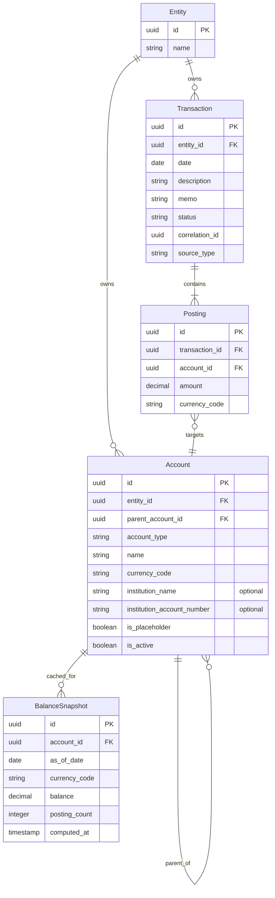

# ADR 0008: Ledger Schema Design — Accounts, Transactions, Postings, and Balances

- Status: Accepted
- Date: 2026-03-05
- Decision Makers: Maintainer(s)
- Phase: 2 — Architecture & System Design
- Source: `llms/tasks/002_architecture_system_design/plan.md` (Step 2, DP-2)

## Context

ADR-0002 established that AurumFinance uses internal double-entry accounting with
a personal-finance UX mapping. ADR-0007 placed the ledger entities in the
`AurumFinance.Ledger` context (Tier 1), entity-scoped via the `Entities` context
(Tier 0). This ADR defines the concrete entity model, relationships, invariants,
and balance derivation strategy for the ledger core.

The ledger must satisfy several competing requirements:

1. **Double-entry correctness** — every transaction produces postings that sum to
   zero per currency, making balance drift impossible by construction.
2. **Multi-currency support** — postings carry original amounts in their original
   currencies; conversions are derived on read, never stored as source of truth
   (ADR-0005).
3. **Immutable facts** — transaction-level facts (amounts, dates, original
   descriptions) are write-once (ADR-0004).
4. **Auditability** — corrections and voids must preserve full history; no
   silent mutations.
5. **Personal-finance UX** — users interact with expenses, income, transfers,
   card purchases, and card payments; the posting model is invisible to them.
6. **Splits** — a single real-world event may distribute its amount across
   multiple accounts (e.g., a grocery receipt split between "Food" and
   "Household").

### Inputs

- ADR-0002: Internal double-entry ledger with personal-finance UX mapping.
- ADR-0004: Immutable facts vs mutable classification.
- ADR-0005: Multi-jurisdiction FX with named rate series.
- ADR-0007: Bounded context boundaries (Ledger context definition).
- GnuCash reference: account hierarchy, splits, Trading Accounts for
  cross-currency balancing (Phase 1 research).

## Decision Drivers

1. Every financial position must be provably correct from the posting history
   alone — no out-of-band balance tables required for correctness.
2. The schema must support multi-currency transactions without violating the
   zero-sum invariant.
3. Splits (multiple postings per transaction) must be a first-class concept, not
   an exception path.
4. Corrections and voids must never destroy history.
5. Balance queries must be correct by default; performance optimization is a
   secondary concern addressed through caching, not by changing the source of truth.

## Decision

### 1. Account Type Hierarchy and Account Tree

Accounts follow the standard five-type hierarchy from double-entry accounting:

```
Account Type        Normal Balance    Balance Equation Role
-----------------------------------------------------------------
Asset               Debit             Left side  (A = L + E + I - X)
Liability           Credit            Right side
Equity              Credit            Right side
Income              Credit            Right side
Expense             Debit             Left side
```

**Normal balance** determines the sign convention: an Asset account increases
with a debit (positive posting amount) and decreases with a credit (negative
posting amount). A Liability account increases with a credit (negative posting
amount) and decreases with a debit (positive posting amount). This convention is
internal only — the UX never exposes debit/credit terminology.

**Account tree model:** Accounts form a tree (parent-child hierarchy) using an
adjacency list model — each account holds a reference to its parent account.
Root accounts have no parent.

```
Assets (root, type: Asset)
  +-- Bank Accounts
  |     +-- Checking Account A
  |     +-- Savings Account B
  +-- Cash
  +-- Brokerage
        +-- Broker X
Liabilities (root, type: Liability)
  +-- Credit Cards
        +-- Card Y
        +-- Card Z
Equity (root, type: Equity)
  +-- Opening Balances
Income (root, type: Income)
  +-- Salary
  +-- Interest
  +-- Dividends
Expenses (root, type: Expense)
  +-- Food
  |     +-- Groceries
  |     +-- Restaurants
  +-- Transport
  +-- Utilities
```

**Design choices for the account tree:**

- **Adjacency list** (each account stores `parent_account_id`) rather than
  materialized path or nested sets. Adjacency list is the simplest model, and
  account trees in personal finance are shallow (typically 3-5 levels). Recursive
  CTEs in PostgreSQL handle subtree queries efficiently at this scale.
- **Account type is inherited** — a child account must have the same type as its
  parent. This is enforced at creation time, not via a database constraint
  (since it requires reading the parent).
- **Every account has a primary currency.** This is the currency in which the
  account's balance is naturally denominated. In the trading-account model,
  postings to a standard account are normally in the account's primary currency
  — cross-currency flows are routed through trading accounts (see section 3)
  so each standard account's postings remain in a single currency. The Ledger
  derives balances as native per-currency amounts; conversion to a display
  currency is a caller responsibility via `ExchangeRates` (ADR-0005, ADR-0014).
- **Accounts are entity-scoped** — every account belongs to exactly one entity
  (ADR-0007).

**Account entity (conceptual fields):**

| Field | Description | Mutability |
|-------|-------------|------------|
| id | Primary key | Immutable |
| entity_id | Owning entity | Immutable |
| parent_account_id | Parent in tree (null for roots) | Mutable (re-parenting) |
| account_type | Asset, Liability, Equity, Income, Expense | Immutable |
| name | Display name | Mutable |
| currency_code | Primary currency (e.g., "USD", "CLP") | Immutable |
| institution_name | Name of the bank or broker holding this account (e.g., "Bank X"). Optional; strongly recommended for accounts that receive imports. Used to cross-check institution metadata extracted from OFX/PDF files. | Mutable |
| institution_account_number | Account identifier at the institution (optional free string — last 4 digits, IBAN, account code, etc.). Aids institution cross-checking and deduplication disambiguation. | Mutable |
| is_placeholder | If true, cannot receive postings (organizational node only) | Mutable |
| is_active | Soft-active flag; inactive accounts are hidden but preserved | Mutable |
| inserted_at | Creation timestamp | Immutable |
| updated_at | Last modification timestamp | Auto |

### 2. Transaction and Posting Entity Structures

A **transaction** represents a single real-world financial event. It is the
top-level grouping entity — the "envelope" that contains one or more postings.

A **posting** is a single debit or credit line within a transaction, targeting
one account. Postings are the atomic unit of the ledger — every financial
movement is recorded as a posting.

**The relationship is always one transaction to N postings** (where N >= 2).
There is no separate "split" entity — splits are simply transactions with more
than two postings. This follows GnuCash's model where every transaction is a
collection of splits (postings).

```
Transaction (one real-world event)
  +-- Posting 1: debit  Account A, amount +100.00 USD
  +-- Posting 2: credit Account B, amount -100.00 USD
```

A split example (grocery receipt divided between two expense categories):

```
Transaction: "Supermarket purchase"
  +-- Posting 1: credit Checking Account, -150.00 USD
  +-- Posting 2: debit  Groceries,         +120.00 USD
  +-- Posting 3: debit  Household,          +30.00 USD
```

**Transaction entity (conceptual fields):**

| Field | Description | Mutability |
|-------|-------------|------------|
| id | Primary key | Immutable |
| entity_id | Owning entity | Immutable |
| date | Transaction date (user-facing) | Immutable (fact) |
| description | Original description from source | Immutable (fact) |
| memo | Optional user or system notes | Mutable |
| status | `posted`, `voided` | Mutable (via void workflow only) |
| correlation_id | Links related transactions (e.g., cross-entity transfers) | Immutable |
| source_type | How the transaction was created: `import`, `manual`, `system` | Immutable |
| inserted_at | Creation timestamp | Immutable |
| updated_at | Last modification timestamp | Auto |

**Posting entity (conceptual fields):**

| Field | Description | Mutability |
|-------|-------------|------------|
| id | Primary key | Immutable |
| transaction_id | Parent transaction | Immutable |
| account_id | Target account | Immutable |
| amount | Signed decimal in `currency_code` | Immutable |
| currency_code | Currency of this posting (e.g., "USD") | Immutable |
| inserted_at | Creation timestamp | Immutable |

**Sign convention:** A positive amount is a debit; a negative amount is a credit.
This is an internal convention only — the UX translates to user-friendly language.

**Posting immutability:** Once a posting is created, its amount, currency, and
account cannot be changed. Corrections are handled by creating reversing
transactions (see section 6).

### 3. Zero-Sum Invariant Enforcement

**The invariant:** Within a transaction, the sum of all posting amounts grouped
by currency must equal zero.

For a single-currency transaction:
```
SUM(posting.amount) WHERE posting.currency_code = 'USD' = 0
```

For a multi-currency transaction, the invariant is enforced **per currency**.
This requires a balancing mechanism for cross-currency transactions.

#### Cross-Currency Balancing: Trading Accounts

Following GnuCash's Trading Accounts model, cross-currency transactions use a
**trading account** as the balancing counterpart. A trading account is a special
account of type Equity that exists per currency pair and absorbs the currency
imbalance.

Example — transferring 100 USD to an account denominated in EUR, where the
exchange rate yields 92 EUR:

```
Transaction: "Transfer USD to EUR account"
  Posting 1: credit Checking (Asset, USD)          -100.00 USD
  Posting 2: debit  Trading:USD-EUR (Equity, USD)  +100.00 USD
  Posting 3: credit Trading:USD-EUR (Equity, EUR)   -92.00 EUR
  Posting 4: debit  Euro Savings (Asset, EUR)        +92.00 EUR
```

Per-currency sums:
- USD: -100.00 + 100.00 = 0
- EUR: -92.00 + 92.00 = 0

The trading account acts as a "currency exchange desk" — it absorbs the value
in one currency and emits it in another. The balance of the trading account
over time tracks cumulative FX gain/loss.

**Trading account rules:**
- Trading accounts are automatically created when needed (one per currency pair
  per entity).
- Trading accounts are of type Equity and are flagged as system-managed.
- Trading accounts are hidden from normal UX views but available in advanced
  reports.
- The UX layer constructs trading-account postings transparently — the user only
  specifies source account, target account, and amounts.

#### Enforcement strategy

The zero-sum invariant is enforced at **two levels**:

1. **Application level (primary):** The `Ledger.create_transaction/3` function
   validates that all postings sum to zero per currency before persisting. This
   runs inside a database transaction — if validation fails, nothing is written.

2. **Database level (safety net):** A database constraint (CHECK or trigger)
   verifies the zero-sum property on the postings table. This catches bugs in
   application code and prevents direct database manipulation from creating
   invalid state. The exact mechanism (CHECK constraint on a materialized
   aggregate vs trigger) is an implementation detail deferred to M1, but the
   requirement for a database-level guard is part of this design.

### 4. Balance Derivation Strategy

**Primary strategy: Computed on read, per currency.**

Account balances are derived by summing postings for the account, grouped by
currency. A balance is a map of `{currency_code => amount}`, not a single
scalar:

```
Balance(account, as_of_date) =
  GROUP BY currency_code:
    SUM(posting.amount)
    WHERE posting.account_id = account.id
      AND transaction.date <= as_of_date
```

This approach guarantees balances are always consistent with the posting
history. There is no stale cache, no invalidation logic, and no risk of
balance drift.

**The Ledger context does not convert currencies.** Conversion to a display
currency (e.g., "show my USD account balance in BRL") is the responsibility
of callers — the Reporting context uses `ExchangeRates` with an explicit rate
type and date. The Ledger only returns native per-currency amounts (ADR-0014,
ADR-0005).

**Performance mitigation: Cached balance snapshots.**

For accounts with large posting histories, computed-on-read may become slow. The
mitigation strategy is **periodic balance snapshots** — a separate, non-
authoritative table that caches the balance at a point in time.

| Field | Description |
|-------|-------------|
| account_id | Account this snapshot is for |
| as_of_date | Date the snapshot represents |
| currency_code | Currency |
| balance | Cached balance value |
| posting_count | Number of postings included |
| computed_at | When this snapshot was last computed |

**Balance snapshot rules:**
- Snapshots are **derived artifacts**, not sources of truth. They can be
  recomputed from postings at any time.
- Balance queries use the snapshot as a starting point and add postings after
  the snapshot date:
  ```
  Balance(account, currency, date) =
    snapshot.balance[currency] + SUM(posting.amount WHERE currency_code = currency
      AND date > snapshot.as_of_date AND date <= target_date)
  ```
- Snapshots are refreshed periodically (e.g., end-of-day, end-of-month) or
  on demand.
- If no snapshot exists, the balance is computed from all postings (correct but
  slower).
- Snapshot recomputation is idempotent and safe to run concurrently.

**Why not materialized/cached-first?**
- Cached-first introduces an invalidation problem: every new posting must
  update the cache atomically. In a multi-currency, multi-account system with
  splits, this means updating N cache entries per transaction inside the same
  database transaction. The complexity and failure modes outweigh the
  performance benefit for a personal finance system.
- PostgreSQL aggregate queries over indexed posting tables perform well for
  the data volumes expected in personal finance (thousands to low millions of
  postings per entity). The snapshot optimization handles the tail case.

### 5. UX Concept to Posting Pair Mapping

The UX presents five personal-finance concepts. Each maps to a specific posting
pattern inside the ledger. The UX layer constructs these postings transparently
— the user never sees debits, credits, or trading accounts.

#### Expense

User intent: "I spent money on something."

```
Transaction: "Coffee shop"
  Posting: credit Source Account (Asset or Liability)  -5.00
  Posting: debit  Expense Category (Expense)           +5.00
```

Source is an Asset (bank) or Liability (credit card). Expense category is a
leaf account in the Expense tree.

#### Income

User intent: "I received money."

```
Transaction: "Monthly salary"
  Posting: debit  Target Account (Asset)   +3000.00
  Posting: credit Income Category (Income) -3000.00
```

#### Transfer

User intent: "I moved money between my accounts."

```
Transaction: "Savings deposit"
  Posting: credit Source Account (Asset)  -500.00
  Posting: debit  Target Account (Asset)  +500.00
```

Both accounts are Assets (or Liabilities). No income or expense is involved.

#### Credit card purchase

User intent: "I bought something with my credit card."

```
Transaction: "Online purchase"
  Posting: credit Credit Card (Liability)    -75.00
  Posting: debit  Expense Category (Expense) +75.00
```

The credit card liability increases (becomes more negative in normal terms —
the credit posting increases the liability's balance in its normal direction).

#### Credit card payment

User intent: "I paid my credit card bill."

```
Transaction: "Card payment"
  Posting: credit Bank Account (Asset)       -1000.00
  Posting: debit  Credit Card (Liability)    +1000.00
```

This reduces both the bank balance and the credit card liability.

#### Cross-currency variants

Any of the above can involve accounts in different currencies. When they do,
trading-account postings are added automatically (see section 3). The user
specifies the amounts in each currency; the system constructs the full posting
set including trading accounts.

Example — expense in a foreign currency:

```
Transaction: "Hotel abroad (paid from USD account, billed in EUR)"
  Posting: credit Checking (Asset, USD)              -110.00 USD
  Posting: debit  Trading:USD-EUR (Equity, USD)       +110.00 USD
  Posting: credit Trading:USD-EUR (Equity, EUR)       -100.00 EUR
  Posting: debit  Travel Expenses (Expense, EUR)      +100.00 EUR
```

The user sees: "Hotel abroad, 100 EUR (110 USD from Checking)."

### 6. Corrections, Voids, and Audit Trail

Following the principle of immutable append (ADR-0004), the ledger never
modifies or deletes existing transactions or postings. Corrections and voids
are handled by creating new transactions that reverse the original.

#### Void

A void cancels a transaction entirely. The original transaction's status is
changed to `voided`, and a new reversing transaction is created with equal and
opposite postings:

```
Original Transaction (status: voided)
  Posting: credit Checking  -100.00
  Posting: debit  Groceries +100.00

Reversing Transaction (status: posted, source_type: system)
  Posting: debit  Checking  +100.00
  Posting: credit Groceries -100.00
  reference: "Void of Transaction #original_id"
```

**Void rules:**
- The original transaction's status is set to `voided`. This is the only
  mutation permitted on a transaction.
- A voided transaction's postings **remain in balance calculations**. The
  reversing transaction's equal-and-opposite postings net the combined effect
  to zero. The `voided` status is a UI/audit flag — it does not filter postings
  from the balance derivation query.
- The reversing transaction carries a reference to the original for audit trail.
- Both the original and the reversal remain in the ledger permanently.

#### Correction

A correction replaces the effect of a transaction with a different one. It is
modeled as a void followed by a new transaction:

1. Void the original transaction (as described above).
2. Create a new transaction with the corrected postings.
3. Link the new transaction to the voided one via `correlation_id`.

This preserves the full history: the original posting, the void, and the
correction are all visible in the audit trail.

#### Why not soft delete?

Soft delete (marking records as deleted) creates ambiguity: is a "deleted"
transaction included in balance calculations? Does it appear in reports? The
void-and-reverse approach is unambiguous — the reversing postings explicitly
cancel the original, and both remain visible for audit purposes.

#### Why not mutation?

Mutating postings (changing amounts, accounts, or currencies after creation)
would break the audit trail. If a posting was included in a reconciliation or
a tax snapshot, mutating it would silently invalidate those downstream records.
Append-only semantics prevent this class of bug entirely.

## Rationale

This design follows GnuCash's proven model for account hierarchy, posting
splits, and trading accounts, adapted for a personal-finance UX layer as
validated by Firefly III's approach (ADR-0002).

The key adaptation is that AurumFinance hides all double-entry mechanics from
the user. The five UX concepts (expense, income, transfer, card purchase, card
payment) are the only financial verbs the user encounters. The posting model,
trading accounts, and sign conventions are entirely internal.

Computed-on-read balance derivation prioritizes correctness over query
performance. For a personal finance system — where the user base is a single
household and the data volume is measured in thousands of transactions per year
— this trade-off is strongly favorable. The snapshot cache provides a
performance escape hatch for accounts with long histories.

The trading accounts approach for cross-currency balancing is chosen over
alternatives (such as allowing per-currency imbalances or using a single
"exchange gain/loss" account) because it maintains the zero-sum invariant
universally and tracks FX exposure per currency pair explicitly.

## Consequences

### Positive

- Balances are provably correct from the posting history — no balance drift
  is possible.
- Multi-currency transactions maintain the zero-sum invariant per currency
  via trading accounts.
- Splits are a natural consequence of the posting model — no special handling
  required.
- Corrections and voids preserve full audit trail with no data loss.
- The UX mapping keeps the internal complexity hidden from users.
- The schema supports arbitrary currencies and account hierarchies without
  hardcoded enumerations.

### Negative / Trade-offs

- Trading accounts add complexity to cross-currency transactions — each
  cross-currency event produces four postings instead of two.
- Computed-on-read balances require scanning postings, which may be slow for
  accounts with very long histories.
- The void-and-reverse pattern doubles the number of postings for corrected
  transactions.
- Application code must construct trading-account postings transparently,
  which adds logic to the transaction creation path.

### Mitigations

- Trading account postings are constructed by a helper function in the Ledger
  context — callers never build them manually.
- Balance snapshots mitigate the computed-on-read performance concern for
  high-volume accounts.
- The void-and-reverse posting overhead is negligible for personal finance
  data volumes and is a standard accounting practice.
- The UX layer provides account-type-aware transaction builders that
  construct correct posting sets from simple inputs (source account, target
  account/category, amount, currency).

## Implementation Notes

- All ledger entities live under `AurumFinance.Ledger` (ADR-0007).
- The Ledger context owns: Account, Transaction, Posting, BalanceSnapshot.
- Trading accounts are Accounts of type Equity with a `system_managed` flag.
- `create_transaction/3` is the single entry point for creating transactions
  with postings. It enforces the zero-sum invariant inside a database
  transaction. No other code path should insert postings directly.
- Account type is stored as a string (`"asset"`, `"liability"`, `"equity"`,
  `"income"`, `"expense"`) — not a database enum — to allow future extensibility.
- Currency codes follow ISO 4217 (e.g., `"USD"`, `"EUR"`) stored as strings.
- The `correlation_id` on transactions is a UUID used to link related
  transactions (voids, corrections, cross-entity transfers). It is optional
  and null for standalone transactions.
- Balance snapshot recomputation should be implemented as an idempotent
  background task, not as a synchronous side-effect of posting creation.
- The database-level zero-sum constraint implementation (CHECK vs trigger)
  should be decided during M1 implementation based on PostgreSQL version
  capabilities and testing.

### Entity Relationship Diagram



### Relationship to Other ADRs

- **ADR-0002:** This ADR implements the double-entry model defined there.
- **ADR-0004:** The fact/classification split is respected — Transaction and
  Posting carry immutable facts only. Classification fields (category, tags,
  etc.) are owned by `AurumFinance.Classification` (ADR-0007), not by the
  Ledger context.
- **ADR-0005:** Postings carry `currency_code` and `amount` as immutable facts.
  The `ExchangeRates` context handles conversions on read. Trading accounts
  complement the FX model by maintaining per-currency zero-sum invariants.
- **ADR-0007:** All entities defined here live within `AurumFinance.Ledger`.
  The Ledger depends on `AurumFinance.Entities` (Tier 0) for entity scoping.
  Upper-tier contexts (`Classification`, `Ingestion`, `Reconciliation`) depend
  on the Ledger — not the reverse.
