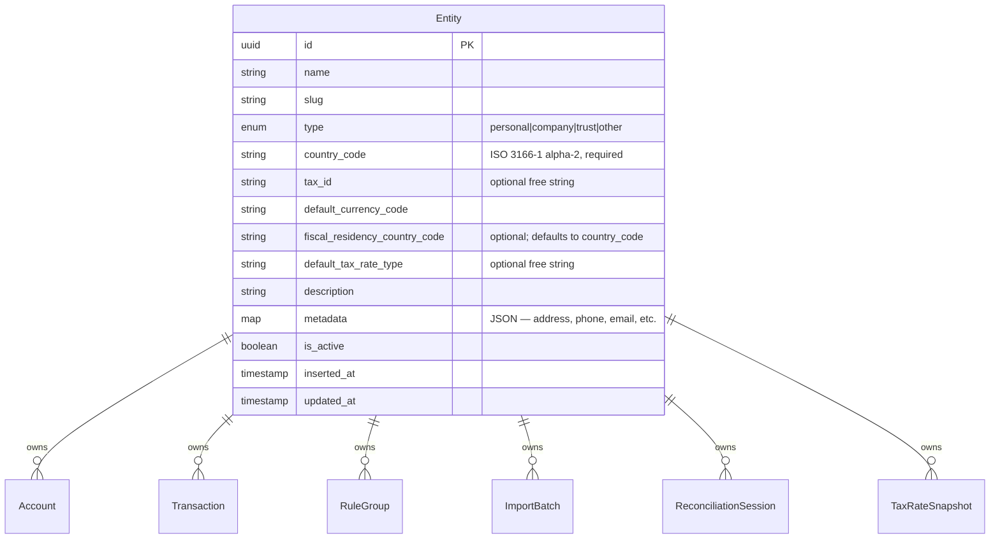
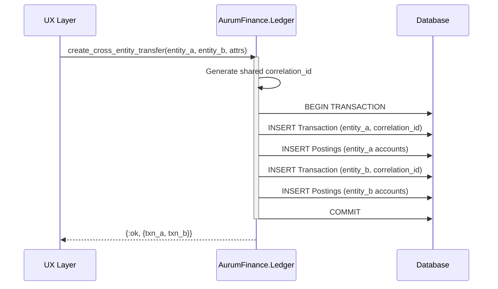

# ADR 0009: Multi-Entity Ownership Model

- Status: Accepted
- Date: 2026-03-05
- Decision Makers: Maintainer(s)
- Phase: 2 — Architecture & System Design
- Source: `llms/tasks/002_architecture_system_design/plan.md` (Step 3, DP-3)

## Context

AurumFinance must support multiple legal/fiscal entities within a single
installation. A single operator may manage finances for a personal account, a
company, a trust, and a side project — each with distinct accounting books,
fiscal residency, and tax obligations.

Phase 1 research identified multi-entity as a gap in all comparable tools:

- **GnuCash** uses separate "books" per entity with no unified model — the user
  runs N independent instances and manually aggregates.
- **Firefly III** has limited multi-entity support that does not isolate
  accounting data cleanly.
- **Actual Budget** has no multi-entity concept at all.

ADR-0007 established `AurumFinance.Entities` as the Tier 0 (foundation) context,
defined the entity as the tenant boundary for all financial data, and identified
which contexts are entity-scoped vs global. ADR-0008 defined the ledger schema
with `entity_id` on accounts and transactions. ADR-0005 defined fiscal residency
as a per-entity concept driving tax rate defaults.

This ADR specifies the entity concept, isolation strategy, authentication
relationship, data scoping rules, cross-entity boundaries, and the interaction
between entities and fiscal residency.

### Inputs

- ADR-0005: Multi-jurisdiction FX with named rate series and immutable tax
  snapshots. Fiscal residency is per-entity and user-configurable.
- ADR-0007: Bounded context boundaries. Entities is Tier 0; no user/accounts
  context exists; authentication is a root password at the edge.
- ADR-0008: Ledger schema design. Accounts and transactions carry `entity_id`.
  Cross-entity transfers use `correlation_id` to link paired transactions.
- Phase 1 finding: multi-entity is a gap in all researched tools.
- `docs/roadmap.md`: Multi-entity support ships in M1 alongside the core ledger.

## Decision Drivers

1. A single operator must be able to manage multiple legal/fiscal entities
   (personal finances, an LLC, a trust) from one installation without running
   separate instances.
2. Entity-scoped data must be fully isolated — a query for Entity A's accounts
   must never return Entity B's data, even by accident.
3. The isolation mechanism must be simple to implement, simple to migrate, and
   simple to back up — complexity should be proportional to a self-hosted
   single-operator tool, not an enterprise multi-tenant SaaS.
4. Cross-entity operations (transfers, consolidated net worth) must be
   explicitly modeled, not ad-hoc.
5. Fiscal residency is per-entity — different entities on the same instance can
   have different tax jurisdictions.
6. There is no user model. The operator owns all entities. Entity selection is a
   UI concern, not an access-control concern.

## Decision

### 1. The Entity Concept

An **entity** is a legal/fiscal ownership unit. It represents a distinct set of
books — a complete, self-contained accounting context.

Examples of entities:

| Entity name | What it represents |
|---|---|
| "Personal" | The operator's personal finances |
| "My LLC" | A company or small business |
| "Family Trust" | A trust or estate |
| "Side Project" | A project or venture with its own financial tracking |

An entity is **not** a user, a role, or an access boundary. There is no
concept of "which user can see which entity" — the single operator has full
access to all entities on the instance.

**Entity (conceptual fields):**

| Field | Description | Required | Mutability |
|---|---|---|---|
| id | Primary key (UUID) | Yes | Immutable |
| name | Display name (e.g., "Personal", "My LLC") | Yes | Mutable |
| slug | URL-friendly identifier, unique per instance | Yes | Mutable |
| type | `:personal`, `:company`, `:trust`, `:other` | Yes | Mutable |
| country_code | Country of incorporation/registration (ISO 3166-1 alpha-2) | Yes | Mutable |
| tax_id | Primary tax identifier for this entity (free string — format is country+type-specific) | No | Mutable |
| default_currency_code | Default currency for new accounts in this entity | Yes | Mutable |
| fiscal_residency_country_code | Country where this entity files its primary tax return. When null, defaults to `country_code`. | No | Mutable |
| default_tax_rate_type | Default rate type for tax-relevant FX snapshots (e.g., `"sii_official"`). When null, tax snapshots require an explicit rate type. | No | Mutable |
| description | Optional free-text description | No | Mutable |
| metadata | JSON map for extensible fields (address, phone, email, secondary tax IDs, etc.) | No | Mutable |
| is_active | Soft-active flag; inactive entities are hidden from the UI but data is preserved | Yes | Mutable |
| inserted_at | Creation timestamp | — | Immutable |
| updated_at | Last modification timestamp | — | Auto |

**On `type`:**
The entity type distinguishes between legal person categories, which affects how
`tax_id` is interpreted:
- `:personal` — natural person (e.g., individual; tax ID format varies by country)
- `:company` — incorporated legal entity (e.g., LLC, S.A., Ltd; company registration number)
- `:trust` — trust or estate
- `:other` — any other ownership structure

The system stores `tax_id` as a free string — no format validation is performed.
The `country_code` + `type` combination tells the operator (and future features)
how to interpret the tax ID.

**On `fiscal_residency_country_code`:**
This is the country where the entity files its primary tax return. It is separate
from `country_code` (country of incorporation) because these often differ:
- A company incorporated in Ireland but paying taxes in Peru → `country_code: "IE"`, `fiscal_residency_country_code: "PE"`
- A personal entity where both are the same → `fiscal_residency_country_code` left null; system resolves to `country_code`

**On `metadata`:**
A JSON map for fields that are not queried by the system: contact information
(address, phone, email), secondary tax registration numbers, notes. No schema
validation — the operator stores what is useful to them.

**Rules:**
- Every instance has at least one entity. The first entity is created during
  initial setup (or seeded).
- Entity names are unique within an instance (enforced at the database level).
- Deleting an entity is not supported — entities can be deactivated. This
  prevents orphaned references from other contexts.
- An entity's ID is a UUID, consistent with all other primary keys in the system.
- The effective fiscal residency country is: `fiscal_residency_country_code ?? country_code`.

### 2. Isolation Strategy: `entity_id` Column Scoping

All entity-scoped data is isolated using an `entity_id` foreign key column on
every entity-scoped table.

**Chosen approach:** Shared database, shared schema, `entity_id` column on every
entity-scoped table.

**Rejected alternatives:**

| Alternative | Why rejected |
|---|---|
| Schema-per-entity (PostgreSQL schemas) | Operational complexity disproportionate to the use case. Every migration must run N times. Connection pooling multiplies by N schemas. Backup and restore become entity-aware. All of this for a single-operator tool that typically has 2-5 entities. |
| Database-per-entity | Same problems as schema separation, amplified. Connection management, cross-database queries for reporting, and backup orchestration add infrastructure complexity that contradicts the self-hosted simplicity goal. |
| Separate instances (Docker containers) | Already the supported path for physical separation between *operators* (ADR-0007). Using it for entity isolation within one operator forces manual aggregation for cross-entity reporting — exactly the GnuCash limitation that AurumFinance aims to solve. |

**Implementation pattern for `entity_id` scoping:**

Every entity-scoped context function accepts an entity (or entity_id) as the
first parameter. The entity_id is included in every query filter.

```
# Conceptual pattern — not implementation code
list_accounts(entity, opts)    # WHERE entity_id = entity.id AND ...
create_account(entity, attrs)  # INSERT ... entity_id = entity.id
get_transaction!(id)           # SELECT ... WHERE id = id (entity_id is on the row)
```

The entity_id column carries a foreign key constraint to the entities table and
a NOT NULL constraint. Every entity-scoped table includes entity_id in its
indexes to ensure query performance.

**No row-level security (RLS):** PostgreSQL RLS is not used because there is no
multi-user access control. The application layer enforces scoping through
context function signatures. The entity_id constraint provides a database-level
safety net against orphaned records.

### 3. Relationship Between Authentication and Data-Owning Entities

There is **no relationship** between authentication and entities. They are
orthogonal concepts:

```
Authentication (edge concern)        Data ownership (domain concern)
---------------------------------    ---------------------------------
Root password via env var            Entity A ("Personal")
Checked by Phoenix plug              Entity B ("My LLC")
Single operator, binary access       Entity C ("Family Trust")
```

Authentication answers: "Is this person allowed to use this instance?"
(yes/no). Entity selection answers: "Which set of books is the user currently
working in?" (a UI state).

**Consequences of this separation:**
- There is no `user_id` column anywhere in the domain model.
- There is no `EntityMembership` or `EntityRole` join table.
- There is no per-entity permission check. If the operator passes the root
  password check, they can access all entities.
- Entity selection is stored as a session-level preference (e.g., a cookie or
  LiveView assign), not as a database-level access filter.
- If physical access separation is ever needed (e.g., a bookkeeper should only
  see one entity), the supported path is running a separate instance — not
  adding an access control layer.

### 4. Entity-Scoped vs Global Data

Every table in the system is classified as either entity-scoped (carries
`entity_id`) or global (shared across all entities).

#### Entity-Scoped Tables

These tables carry an `entity_id` column. All queries filter by entity.

| Context | Entity-Scoped Data | Notes |
|---|---|---|
| **Entities** | Entity | Entity IS the boundary; fiscal residency fields are columns on Entity |
| **Ledger** | Account, Transaction, Posting, BalanceSnapshot | All financial positions are entity-scoped |
| **Classification** | ClassificationRecord, ClassificationAuditLog | Classification results are entity-scoped (one record per transaction) |
| **Ingestion** | ImportBatch, ImportFile, ImportRow, DeduplicationRecord | Every import targets a specific entity |
| **Reconciliation** | ReconciliationSession, MatchResult, Discrepancy | Reconciliation operates on entity-scoped postings |
| **ExchangeRates** | TaxRateSnapshot | Tax snapshots reference entity-specific tax events |
| **Reporting** | RecurringPattern, Projection, AnomalyAlert | Derived from entity-scoped data |

#### Global Tables

These tables have **no** `entity_id` column. Their data is shared across all
entities on the instance.

| Context | Global Data | Rationale |
|---|---|---|
| **ExchangeRates** | Currency, RateSeries, RateRecord | Currencies and exchange rates are real-world facts independent of any entity. A rate for USD/EUR on a given date is the same regardless of which entity is viewing it. |
| **Classification** | RuleGroup, Rule, Condition, Action | Rule groups are global. Entity-specific matching is achieved via condition fields (`entity_name`, `entity_slug`, `entity_type`, `entity_country_code`, `institution_name`), not ownership. |

#### The Boundary Cases

**Trading accounts (Equity type, system-managed):** Entity-scoped. Each entity
has its own set of trading accounts because trading accounts track FX exposure
per entity's books. Entity A's USD-EUR trading account is independent of
Entity B's.

**Account tree structure:** Entity-scoped. Each entity has its own complete
chart of accounts. There is no shared or inherited account tree.

**Rate series definitions:** Global. A rate series like "market:USD/CLP" is
defined once and shared. Different entities may reference different rate series
as their tax-relevant default (via fiscal residency), but the series itself
is not duplicated.

### 5. Cross-Entity Operations

Two cross-entity scenarios are explicitly supported:

#### 5a. Cross-Entity Transfers

A cross-entity transfer represents moving money between two entities owned by
the same operator (e.g., lending money from "Personal" to "My LLC").

**Model:** Two correlated transactions, one in each entity, linked by a shared
`correlation_id` (UUID).

```
Entity A ("Personal")
  Transaction: "Loan to My LLC"
    correlation_id: "abc-123"
    Posting: credit Checking Account (Asset, Personal)  -5000.00 USD
    Posting: debit  Loans Receivable (Asset, Personal)   +5000.00 USD

Entity B ("My LLC")
  Transaction: "Loan from Personal"
    correlation_id: "abc-123"
    Posting: debit  Business Checking (Asset, My LLC)    +5000.00 USD
    Posting: credit Loans Payable (Liability, My LLC)    -5000.00 USD
```

**Rules:**
- Each transaction is fully self-contained within its entity. It satisfies the
  zero-sum invariant independently (ADR-0008).
- The `correlation_id` is the only link between the two transactions. It is
  stored on both transactions and can be queried to find the paired transaction.
- Cross-entity transfers are **not** a special transaction type. They are
  standard transactions that happen to share a correlation_id. The Ledger
  context does not need special cross-entity logic.
- The UX layer handles the creation of both transactions when the user initiates
  a cross-entity transfer. The two transactions are created in a single database
  transaction to ensure atomicity.
- If the transfer involves different currencies, each transaction independently
  uses trading accounts as specified in ADR-0008.

#### 5b. Cross-Entity Reporting (Consolidated Views)

The operator may want to see aggregate financial information across entities:

- "What is my total net worth across all entities?"
- "What are my combined monthly expenses?"
- "What is the total value of all investment accounts?"

**Model:** Cross-entity reporting is a **read-only aggregation** in the
Reporting context. It queries entity-scoped data from multiple entities and
aggregates the results. It does not create, modify, or move any data.

**Rules:**
- Cross-entity reports always convert to a single display currency using the
  ExchangeRates context (ADR-0005).
- Each entity's contribution to the aggregate is labeled — the report shows
  per-entity breakdowns, not just totals.
- Cross-entity reporting does not require any special data model. It is a query
  pattern: `WHERE entity_id IN (list_of_entity_ids)` with aggregation.
- The Reporting context's API surface reflects this: functions accept either a
  single entity or a list of entities.

```
# Conceptual API
get_net_worth(entity, opts)             # Single entity
get_net_worth_consolidated(entities, opts)  # Cross-entity aggregate
```

### 6. Entity and Fiscal Residency Interaction

Fiscal residency is a property of an entity, stored directly as columns on the
Entity table. No separate `FiscalResidency` table exists.

The two relevant columns on Entity are:
- `fiscal_residency_country_code` — where this entity files its primary tax return (optional; defaults to `country_code` when null)
- `default_tax_rate_type` — the rate type used for tax-relevant FX snapshots (optional free string, e.g. `"sii_official"`)

**Effective fiscal residency resolution:**

```
effective_fiscal_residency_country = entity.fiscal_residency_country_code ?? entity.country_code
effective_tax_rate_type = entity.default_tax_rate_type  # nil means explicit rate type required
```

**Relationship to ExchangeRates (ADR-0005):**

When a tax-relevant event occurs in an entity, the system reads the entity's
`default_tax_rate_type` to determine which rate series to snapshot. The rate type
is a string key referencing a rate series in the ExchangeRates context (global data).

```
Tax event in Entity A ("Personal", country: CL, fiscal_residency_country_code: null → resolves to CL)
  -> entity.default_tax_rate_type = "sii_official"
  -> Snapshot: ExchangeRates.get_rate("USD/CLP", "sii_official", event_date)

Tax event in Entity B ("My LLC", country: IE, fiscal_residency_country_code: "PE")
  -> entity.default_tax_rate_type = "sunat_official"
  -> Snapshot: ExchangeRates.get_rate("USD/PEN", "sunat_official", event_date)
```

**Rules:**
- `fiscal_residency_country_code` is optional. When null, the system treats `country_code` as the fiscal residency.
- `default_tax_rate_type` is optional. When null, tax-relevant events require an explicit rate type to be passed — no default is applied.
- Both fields can be changed (e.g., the operator moves countries or updates their tax setup). Existing tax snapshots are immutable and retain the rate recorded at the time of the event (ADR-0005). Only future events use the updated values.
- Both fields are user-configurable free strings — no hardcoded country or rate type list (ADR-0005).

### Entity Relationship Diagram



### Cross-Entity Transfer Diagram



## Rationale

### Why `entity_id` column scoping over schema separation?

For a self-hosted single-operator tool with 2-5 entities, the operational
overhead of schema separation far outweighs its benefits:

| Concern | `entity_id` column | Schema-per-entity |
|---|---|---|
| Migrations | Run once | Run N times |
| Connection pooling | One pool | N pools (or multiplexed) |
| Cross-entity queries | Standard SQL with IN clause | Cross-schema joins or UNION |
| Backup/restore | Single database dump | Per-schema or coordinated |
| New entity creation | INSERT one row | CREATE SCHEMA + run all migrations |
| Code complexity | Standard Ecto queries with a filter | Dynamic schema routing in every query |

Schema separation provides stronger isolation guarantees, but those guarantees
solve a problem AurumFinance does not have — preventing one *tenant's
administrators* from accessing another tenant's data. In AurumFinance, the
operator owns all entities by design.

### Why no user-entity relationship?

Adding a user model would require:
- A users table with authentication credentials
- An entity_memberships join table with roles/permissions
- Authorization checks on every context function
- Registration, login, password reset, and session management flows

This is a substantial amount of infrastructure for a tool whose deployment model
is: one operator, one instance, root password. The complexity is not justified
by the use case. If physical access separation is needed, the operator runs a
second instance — a model that GnuCash has validated as sufficient for decades.

### Why is fiscal residency per-entity?

A single person may have different tax obligations for different legal
structures. For example:
- "Personal" entity: fiscal residency in Chile, taxes reported to SII
- "My LLC" (registered in Peru): fiscal residency in Peru, taxes reported to
  SUNAT

If fiscal residency were per-instance, the operator would need separate
instances per jurisdiction — exactly the fragmentation that multi-entity support
is designed to avoid.

### Why correlation_id for cross-entity transfers instead of a special transaction type?

A special "cross-entity transaction" type would require the Ledger context to
understand multi-entity semantics — violating the principle that each
transaction is self-contained within its entity and independently satisfies the
zero-sum invariant. The correlation_id approach keeps each transaction standard
and self-contained. The cross-entity relationship is metadata, not structure.

## Consequences

### Positive

- Multiple legal/fiscal entities coexist in a single installation with full
  data isolation via `entity_id` scoping.
- Cross-entity reporting provides consolidated views without data duplication
  or movement.
- Fiscal residency per entity enables correct multi-jurisdiction tax tracking
  for a single operator managing diverse legal structures.
- No user model, no access control layer, no entity membership — the domain
  model stays focused on financial data.
- The isolation strategy is simple to implement, test, and debug — standard
  Ecto queries with an additional filter.
- Cross-entity transfers are modeled with standard transactions and a
  correlation_id — no special transaction types or cross-entity mutations.

### Negative / Trade-offs

- `entity_id` scoping relies on application-level discipline. Every entity-scoped
  query must include the entity_id filter. A missing filter could leak data
  across entities.
- No database-level isolation between entities. A bug that omits the entity_id
  filter in a query will silently return data from all entities.
- Cross-entity transfers require two transactions to be created atomically.
  If the database transaction fails partway, the transfer is incomplete (though
  the DB transaction ensures atomicity).

### Mitigations

- **Scoping discipline:** Context functions take an entity as the first
  parameter. This makes the scoping visible at the API level. Code review and
  tests should verify that entity_id is always included in queries.
- **Test coverage:** Tests should include multi-entity scenarios — create data
  in Entity A, query from Entity B, verify no leakage.
- **Query composition:** Lower-tier contexts can expose scoped query builders
  (e.g., `list_accounts_query(entity)`) that bake in the entity_id filter. Upper
  tiers compose on top of these pre-scoped queries.
- **Future option:** If stronger isolation is ever needed, PostgreSQL RLS can be
  layered on top of the existing `entity_id` columns without schema changes. The
  current design does not preclude this.
- **Atomicity:** Cross-entity transfers are wrapped in a single Ecto.Multi /
  database transaction. Both transactions are created or neither is.

## Implementation Notes

- All entity-related code lives under `AurumFinance.Entities` (ADR-0007).
- The Entities context owns: Entity only. No separate FiscalResidency table.
- Entity is the first table created in M1 — all other entity-scoped tables
  reference it.
- The `entity_id` column on every entity-scoped table should have:
  - A NOT NULL constraint.
  - A foreign key constraint to the entities table.
  - An index (often as part of a composite index with other query fields).
- `fiscal_residency_country_code` and `default_tax_rate_type` are nullable
  columns on the entities table. Application logic resolves effective fiscal
  residency as `fiscal_residency_country_code ?? country_code`.
- `metadata` is stored as a JSONB column (PostgreSQL). No schema validation at
  the database level; validation (if any) is at the application layer.
- `tax_id` is a nullable VARCHAR. No format validation — stored as entered.
- Entity selection in the UI is a session-level concept — stored in the LiveView
  socket assigns or a signed session cookie. It is not a database-level filter.
- The Entities context API is intentionally small. Its primary role is to define
  the scoping boundary that all other contexts depend on.
- `correlation_id` on Transaction (defined in ADR-0008) is the mechanism for
  linking cross-entity transfers. No additional schema is needed.

### Relationship to Other ADRs

- **ADR-0005:** Fiscal residency is per-entity, as specified in ADR-0005's
  design. This ADR concretizes the ownership: fiscal residency fields
  (`fiscal_residency_country_code`, `default_tax_rate_type`) are columns on
  the Entity table — no separate table exists.
- **ADR-0007:** This ADR implements the Entities context defined in ADR-0007
  (Tier 0). It confirms that no user/accounts context exists and that
  authentication is orthogonal to entity ownership.
- **ADR-0008:** Accounts and transactions carry entity_id as defined in
  ADR-0008. Cross-entity transfers use correlation_id as defined in ADR-0008.
  This ADR specifies the semantics of that correlation.
