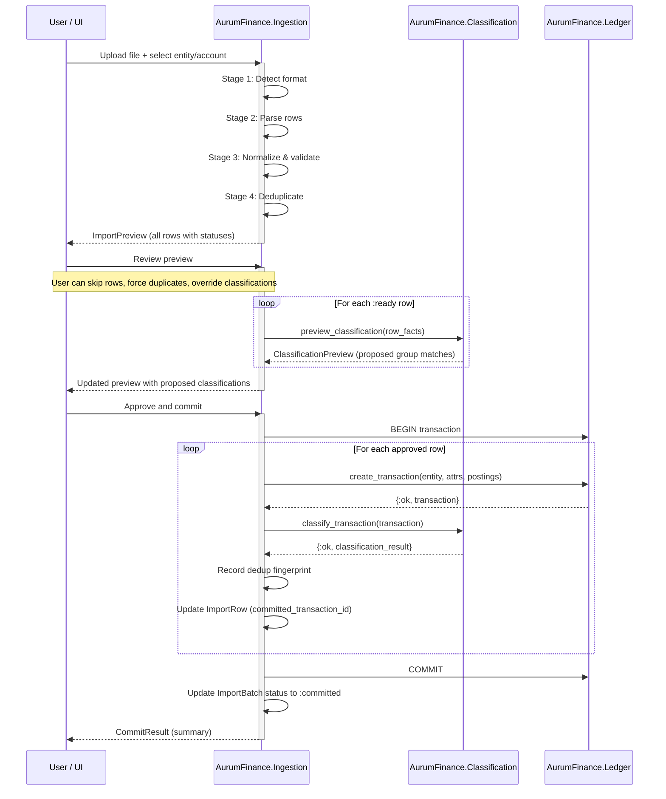
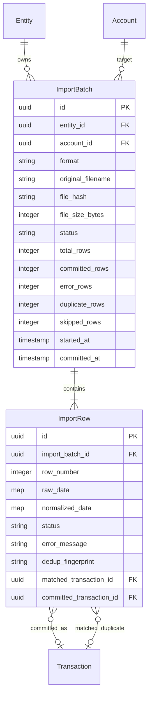

# ADR 0010: Ingestion Pipeline Architecture

- Status: Accepted
- Date: 2026-03-05
- Decision Makers: Maintainer(s)
- Phase: 2 — Architecture & System Design
- Source: `llms/tasks/002_architecture_system_design/plan.md` (Steps 4+5, DP-4)

## Context

AurumFinance's primary data entry path is importing bank and broker statements.
The ingestion pipeline must transform raw file data into classified ledger
postings while preserving immutable facts (ADR-0004), enforcing idempotency,
and giving the user full control through a preview-before-commit workflow.

ADR-0007 placed ingestion in the `AurumFinance.Ingestion` context (Tier 2),
depending on `Entities` (Tier 0), `Ledger` (Tier 1), and `Classification`
(Tier 2). The pipeline is the orchestrator — it calls Classification;
Classification does not know about imports.

ADR-0008 defines the ledger entities (Transaction, Posting) that the pipeline
ultimately creates. ADR-0009 defines the Entity model — every import targets a
specific entity and account.

Phase 1 research validated Firefly III's pattern of separating the importer
from the core ledger as an explicit maintenance boundary.

### Inputs

- ADR-0003: Grouped rules engine with per-group priority and explainability.
- ADR-0004: Immutable facts vs mutable classification with manual override
  protection.
- ADR-0007: Bounded context boundaries. Ingestion is Tier 2; depends on Ledger,
  Classification, and Entities.
- ADR-0008: Ledger schema design. Transactions and postings model.
- ADR-0009: Multi-entity ownership model. Entity fields include `type`,
  `country_code`, `default_currency_code`.
- ADR-0011: Rules engine data model (designed jointly with this ADR).
- Phase 1: Firefly III's separate importer pattern.

## Decision Drivers

1. Imported statement data is legal evidence — the pipeline must preserve raw
   data exactly as received (ADR-0004).
2. The user must see and approve proposed transactions before anything is written
   to the ledger — preview-before-commit is mandatory.
3. Importing the same file twice must not create duplicate transactions —
   idempotency is a hard requirement.
4. Adding support for new file formats (CSV variants, OFX, QIF) must not
   require changes to the core pipeline logic.
5. Every imported row must retain a reference back to its source batch for
   provenance and auditability.
6. The pipeline must handle partial imports and malformed rows gracefully —
   one bad row must not abort the entire import.

## Decision

### 1. Pipeline Stages

The ingestion pipeline processes data through six sequential stages. Each stage
has a single responsibility and a well-defined input/output contract.

```
                                 AurumFinance.Ingestion
  +------------------------------------------------------------------------+
  |                                                                        |
  |  Stage 1        Stage 2       Stage 3          Stage 4                 |
  |  Upload &  -->  Parse &  -->  Normalize &  --> Deduplicate             |
  |  Detect         Extract       Validate                                 |
  |                                                                        |
  +------------------------------------------------------------------------+
                                       |
                                       v
                          +------------------------+
                          |  Stage 5: Preview      |
                          |  (user reviews         |
                          |   proposed txns +      |
                          |   proposed classif.)   |
                          +------------------------+
                                       |
                               user approves
                                       |
                                       v
                          +------------------------+
                          |  Stage 6: Commit       |
                          |  (write to Ledger +    |
                          |   apply Classification)|
                          +------------------------+
```

**Stage 1 — Upload and Format Detection**

- The user uploads a file and **must select the target account** (mandatory).
  Account selection is required before the import can proceed — it cannot be
  inferred from the file alone, particularly for CSV files which carry no
  institution or account metadata.
- The selected account provides the institution context (`institution_name`,
  `institution_account_number`) that the file itself may not contain.
- The system detects the file format using registered format adapters.
- An `ImportBatch` record is created with `entity_id` and `account_id` set
  from the user's selection (both immutable after creation).
- For formats that include institution metadata in the file header (OFX, QFX,
  PDF), the parser extracts it and cross-checks against the selected account's
  `institution_name` and `institution_account_number`. A mismatch produces a
  **warning** (not a block) — the user may be importing from a different export
  of the same account, or the institution name may differ slightly in formatting.
- If format detection fails, the user is prompted to select a format manually
  or configure a custom CSV column mapping.

**Stage 2 — Parse and Extract**

- The format adapter parses the raw file into a list of `ImportRow` records.
- Each `ImportRow` contains the raw field values as strings, preserving the
  original data exactly as it appeared in the file.
- Rows that fail parsing (malformed, encoding issues) are flagged with
  `status: :parse_error` and an error description. They are included in the
  batch but excluded from subsequent stages.
- The raw file content is stored (or its hash retained) for reproducibility.

**Stage 3 — Normalize and Validate**

- Raw string values are converted to typed values: amounts to decimals, dates
  to date structs, currency codes validated against known currencies.
- This is the **fact/classification split point**: normalized values become the
  immutable fact layer. The fields produced here (amount, date, description,
  currency, institution reference) will be written as immutable Transaction and
  Posting fields.
- Validation rules are applied: required fields present, amount is numeric,
  date is parseable, currency code is valid.
- Rows that fail validation are flagged with `status: :validation_error`.

**Stage 4 — Deduplicate**

- Each normalized row is checked against existing transactions in the target
  account to detect duplicates.
- The deduplication key is computed from the raw row data (see section 4 for
  the full strategy).
- Rows identified as duplicates are flagged with `status: :duplicate` and
  linked to the existing transaction they match.
- Rows that pass deduplication are flagged with `status: :ready`.

**Stage 5 — Preview**

- All rows (including errors and duplicates) are presented to the user as an
  `ImportPreview`.
- For each `:ready` row, the system invokes `Classification.preview_classification/1`
  to show proposed rule matches and classification outcomes.
- The user reviews the preview and can:
  - Accept all ready rows.
  - Exclude specific rows (mark as `:skipped`).
  - Override proposed classifications before commit.
  - Force-include rows flagged as duplicates (override deduplication).
  - Correct parse/validation errors and re-process individual rows.
- No data is written to the Ledger during preview. The preview state is held
  in the `ImportBatch` record (and its associated `ImportRow` records).

**Stage 6 — Commit**

- For each row the user approved, the pipeline:
  1. Creates a `Transaction` and `Posting(s)` in the Ledger context, with
     `source_type: :import`.
  2. Invokes `Classification.classify_transaction/1` to apply rule-based
     classification.
  3. Records the deduplication fingerprint for future imports.
  4. Updates the `ImportRow` status to `:committed` and stores a reference to
     the created Transaction.
- All writes for a single batch are wrapped in a database transaction. If any
  row fails during commit, the entire batch is rolled back and the error is
  reported. The user can then fix the issue and retry.
- After successful commit, the `ImportBatch` status is updated to `:committed`.

### 2. Fact/Classification Split Point

The split between immutable facts and mutable classification happens at
**Stage 3 (Normalize and Validate)**:

```
Raw file data (strings)
       |
       v
  Stage 3: Normalize
       |
       +---> Immutable facts: amount, date, description, currency_code,
       |     institution_reference. Written to Transaction and Posting
       |     fields. Never modified after creation (ADR-0004).
       |
       +---> Classification input: the same fact fields are passed to the
             Classification context as read-only inputs for rule evaluation.
             Classification produces mutable outputs (category, tags,
             investment_type, notes) stored in ClassificationRecord
             (ADR-0011).
```

The pipeline creates facts first (Transaction + Postings in the Ledger), then
invokes Classification on the created transaction. Classification reads
transaction facts but never modifies them.

### 3. Import Batch and File Tracking Model

Every import operation is tracked through two entities:

**ImportBatch** — represents a single import operation (one file upload).

| Field | Description | Mutability |
|-------|-------------|------------|
| id | Primary key (UUID) | Immutable |
| entity_id | Target entity | Immutable |
| account_id | Target account for imported transactions | Immutable |
| format | Detected or selected format identifier (e.g., `"csv_generic"`, `"ofx"`) | Immutable |
| original_filename | Name of the uploaded file | Immutable |
| file_hash | SHA-256 hash of the raw file content | Immutable |
| file_size_bytes | Size of the uploaded file | Immutable |
| status | Batch lifecycle state (see below) | Mutable |
| total_rows | Total number of parsed rows | Mutable (set after parse) |
| committed_rows | Number of rows successfully committed | Mutable (set after commit) |
| error_rows | Number of rows with errors | Mutable (set after parse/validate) |
| duplicate_rows | Number of rows flagged as duplicates | Mutable (set after dedup) |
| skipped_rows | Number of rows skipped by user | Mutable (set after commit) |
| started_at | When the import was initiated | Immutable |
| committed_at | When the batch was committed (null until committed) | Mutable |
| inserted_at | Creation timestamp | Immutable |
| updated_at | Last modification timestamp | Auto |

**ImportBatch status lifecycle:**

```
:uploading --> :parsing --> :parsed --> :previewing --> :committed
                  |            |             |               |
                  v            v             v               v
              :parse_failed  :validation_  :abandoned    :commit_failed
                              failed                          |
                                                              v
                                                     :partially_committed
```

- `:uploading` — file received, not yet parsed.
- `:parsing` — format adapter is processing the file.
- `:parsed` — all rows parsed; some may have errors.
- `:previewing` — user is reviewing the preview.
- `:abandoned` — user discarded the batch before committing; terminal state.
- `:committed` — all approved rows written to the ledger.
- `:commit_failed` — commit was attempted but failed entirely (rolled back).
- `:partially_committed` — reserved for future partial-commit support; not
  used in the initial implementation (full batch atomicity).
- `:parse_failed` — format adapter could not process the file at all.
- `:validation_failed` — normalization/validation failed for the entire batch
  (e.g., wrong format selected).

**ImportRow** — represents a single parsed row from the import file.

| Field | Description | Mutability |
|-------|-------------|------------|
| id | Primary key (UUID) | Immutable |
| import_batch_id | Parent batch | Immutable |
| row_number | 1-based position in the source file | Immutable |
| raw_data | Original row data as a JSON map (key-value pairs as parsed) | Immutable |
| normalized_data | Typed/validated data as a JSON map (after Stage 3) | Mutable (set during normalization) |
| status | Row lifecycle state: `:parsed`, `:parse_error`, `:validation_error`, `:duplicate`, `:ready`, `:skipped`, `:committed` | Mutable |
| error_message | Human-readable error description (null if no error) | Mutable |
| dedup_fingerprint | Computed deduplication key (see section 4) | Mutable (set during dedup) |
| matched_transaction_id | If duplicate, the existing transaction it matches | Mutable |
| committed_transaction_id | After commit, the transaction that was created | Mutable |
| inserted_at | Creation timestamp | Immutable |
| updated_at | Last modification timestamp | Auto |

**Provenance:** Every Transaction created by the pipeline carries
`source_type: :import`. The `ImportRow.committed_transaction_id` links back
from the import row to the ledger transaction. The reverse lookup (from
transaction to import row) is supported via a query on `ImportRow` where
`committed_transaction_id = transaction.id`.

### 4. Deduplication Strategy and Conflict Resolution

#### Deduplication Key

The deduplication key (fingerprint) is derived from **raw row data only** — it
does not rely on any system-assigned ID. This ensures that the same source data
always produces the same fingerprint, regardless of when or how many times it
is imported.

**Primary fingerprint computation:**

```
fingerprint = hash(
  account_id,
  normalized_date,
  normalized_amount,
  normalized_currency_code,
  institution_reference OR normalized_description
)
```

The hash function is SHA-256, producing a deterministic, collision-resistant
fingerprint.

**Institution reference preferred:** When the source data includes an
institution-assigned transaction ID (e.g., a bank reference number), that is
used as the primary discriminator. When no institution reference is available,
the original description is used instead.

**Why not description alone?** Many institutions produce identical descriptions
for different transactions on the same day (e.g., two separate purchases at
the same merchant). The combination of date + amount + description reduces
false positives but cannot eliminate them entirely for genuinely identical
transactions.

#### Deduplication Scope

Deduplication is scoped to the **target account** within the **target entity**.
A transaction in Account A does not deduplicate against a transaction in
Account B, even within the same entity.

#### Conflict Resolution

When a duplicate is detected:

1. The `ImportRow` is flagged with `status: :duplicate` and
   `matched_transaction_id` is set.
2. During preview, the user sees the duplicate alongside the existing
   transaction.
3. The user can:
   - **Skip** — accept the deduplication decision (default).
   - **Force import** — override the duplicate flag and create a new
     transaction. This is necessary for genuinely repeated transactions (e.g.,
     two identical purchases at the same store on the same day).
   - **Replace** — void the existing transaction and import the new one
     (useful when re-importing a corrected statement).

Force-imported transactions receive a distinct deduplication fingerprint
(appended with a counter) to prevent re-flagging on future imports.

#### File-Level Deduplication

Before row-level deduplication, the pipeline checks `ImportBatch.file_hash`
against previously committed batches for the same entity and account. If an
identical file was already fully committed, the user is warned. This is a
soft warning — the user can proceed if they intend to re-import (e.g., after
voiding previous transactions).

### 5. Preview-Before-Commit Workflow

The preview workflow is the central user interaction point. It ensures no data
is written to the ledger without explicit user approval.



**Preview state management:**

- The preview is stored in the database as `ImportRow` records with their
  statuses. This allows the preview to survive page reloads and browser
  disconnects.
- The `ImportBatch` status is `:previewing` while the user is reviewing.
- User decisions (skip, force, override) are recorded as updates to individual
  `ImportRow` records.
- There is no time limit on the preview. The user can return to an uncommitted
  batch and resume review.
- An uncommitted batch can be abandoned (status set to `:abandoned`).

**Classification during preview:**

- The Classification context's `preview_classification/1` function evaluates
  rules against the row's fact data without writing any classification records.
- It returns a `ClassificationPreview` struct showing which groups fired, which
  rules matched, and what field values would be set.
- The user can override proposed classifications during preview. These overrides
  are recorded on the `ImportRow` and applied as manual classifications (with
  `classified_by: :user` and `manually_overridden: true`) during commit.

### 6. Error Handling for Partial Imports and Malformed Data

**Row-level error isolation:** Errors in individual rows do not prevent the
rest of the batch from being processed. Each row is independently parsed,
validated, and deduplicated.

**Error categories:**

| Category | Stage | Behavior |
|----------|-------|----------|
| Parse error | Stage 2 | Row flagged `:parse_error` with description. Excluded from subsequent stages. |
| Validation error | Stage 3 | Row flagged `:validation_error`. User can correct and re-validate. |
| Duplicate | Stage 4 | Row flagged `:duplicate`. User chooses skip/force/replace in preview. |
| Encoding error | Stage 2 | File encoding issues (non-UTF-8) produce parse errors. Format adapters should attempt encoding detection. |

**Batch-level errors:**

| Scenario | Behavior |
|----------|----------|
| File entirely unparseable | Batch set to `:parse_failed`. User informed of likely cause. |
| Wrong format selected | Batch set to `:validation_failed` after normalization produces mostly errors. User prompted to select a different format. |
| Commit failure (DB error) | Entire batch rolled back. Batch set to `:commit_failed`. User can retry. |

**User correction workflow:**

- During preview, the user can edit individual rows that have validation errors.
- Edited rows are re-validated and their status updated.
- This does not modify the `raw_data` field — the correction is stored in
  `normalized_data` as an override, and the raw data remains immutable for
  audit purposes.

### 7. Idempotency Guarantees

**Same file, same result:** Importing the same file to the same entity and
account produces no new transactions if the file was already fully committed.

The idempotency mechanism operates at two levels:

1. **File-level:** `ImportBatch.file_hash` is checked against committed batches.
   If a match is found, the user is warned (soft check — not blocking).

2. **Row-level:** Each row's `dedup_fingerprint` is checked against existing
   transactions in the target account. Matching rows are flagged as duplicates.

**Re-import after void:** If a user voids transactions from a previous import
and then re-imports the same file, the voided transactions' fingerprints remain
in the deduplication records. The user must force-import to re-create them.
This is intentional — it prevents accidental re-creation of voided data.

**Re-import of corrected statement:** If an institution issues a corrected
statement, the user can use the "replace" option during dedup conflict
resolution to void old transactions and import the corrected versions.

### 8. Extensibility Model for New File Formats

New file formats are added by implementing a **format adapter** — a module
that conforms to a defined behaviour.

**FormatAdapter behaviour (conceptual):**

```
@callback detect(file_content :: binary()) :: {:ok, format_id} | :no_match

@callback parse(file_content :: binary(), opts :: keyword()) ::
  {:ok, [raw_row_map()]} | {:error, parse_error()}

@callback column_mapping(opts :: keyword()) :: column_mapping()
```

- `detect/1` — examines file content (magic bytes, headers, structure) and
  returns whether this adapter can handle the file. Multiple adapters are
  tried in sequence; the first match wins.
- `parse/1` — converts the raw file content into a list of maps, where each
  map represents one row with string key-value pairs.
- `column_mapping/1` — returns the mapping from source columns to normalized
  fields (date, amount, description, currency, institution_reference).

**Built-in adapters (initial set):**

| Adapter | Format | Detection method |
|---------|--------|-----------------|
| `CsvGeneric` | Generic CSV with configurable column mapping | File extension + header row heuristics |
| `Ofx` | OFX/QFX (Open Financial Exchange) | XML/SGML structure detection |
| `Qif` | QIF (Quicken Interchange Format) | Line-prefix pattern detection |

**Custom CSV mappings:**

CSV is the most common bank export format, but column layouts vary by
institution. The `CsvGeneric` adapter supports user-defined column mappings:

- The user specifies which columns map to date, amount, description, currency,
  and institution reference.
- Column mappings are saved per entity + institution combination for reuse.
- A mapping can include transformation rules (e.g., "amount is in column 3,
  multiply by -1 for expenses" or "date format is DD/MM/YYYY").

**Adding a new adapter:**

1. Create a module implementing the `FormatAdapter` behaviour.
2. Register it in the adapter registry (a configuration list).
3. No changes to pipeline stages, deduplication, preview, or commit logic.

The pipeline stages (normalize, validate, deduplicate, preview, commit) are
format-agnostic. They operate on the normalized output of the format adapter.

## Rationale

### Why a staged pipeline over a monolithic import function?

Staged processing allows each concern (parsing, validation, deduplication,
preview, commit) to be tested, debugged, and extended independently. It also
enables the preview-before-commit workflow naturally — the pipeline pauses
between Stage 4 and Stage 6, waiting for user approval.

### Why store raw data on ImportRow?

Preserving the raw data enables audit, debugging, and re-processing. If a
format adapter is improved, old imports can be re-parsed against the raw data
to verify correctness. The raw data is also essential for provenance — proving
what the institution reported.

### Why full-batch atomicity on commit?

Partial commits (some rows committed, others not) create complex recovery
scenarios: which rows were committed? Which need retry? What if the user
re-imports? Full-batch atomicity avoids this class of problem entirely. For
the data volumes typical in personal finance (dozens to hundreds of rows per
statement), a single database transaction is efficient.

### Why the pipeline calls Classification, not the reverse?

The dependency direction is explicit: Ingestion depends on Classification
(ADR-0007). Classification is a general-purpose engine that can classify any
transaction — it does not know or care whether the transaction came from an
import, was entered manually, or was created by the system. This keeps
Classification focused and reusable.

### Why SHA-256 for deduplication fingerprints?

SHA-256 is deterministic, collision-resistant, and fast. The fingerprint is
computed from a small amount of data (a few fields per row), so performance
is not a concern. The determinism ensures that the same input always produces
the same fingerprint, which is the core requirement for idempotency.

## Consequences

### Positive

- Raw import data is preserved immutably for audit and debugging.
- Preview-before-commit gives the user full control over what enters the
  ledger.
- Idempotent imports prevent duplicate transactions from file re-imports.
- Format adapters are pluggable — new formats require no pipeline changes.
- Row-level error isolation prevents one bad row from blocking the entire
  import.
- Full provenance chain: file -> batch -> row -> transaction.
- Classification is invoked by the pipeline but remains decoupled — it can
  be used independently for manual transactions.

### Negative / Trade-offs

- Full-batch atomicity means a single commit failure rolls back all rows.
  For very large imports (thousands of rows), this may be slow or hit
  database transaction limits.
- Storing raw data per row increases storage requirements. For a personal
  finance system, this is negligible.
- The preview workflow adds user interaction steps compared to a fully
  automatic import. This is intentional — automation without review is a
  non-goal.
- Deduplication based on row data heuristics can produce false positives
  (genuinely different transactions flagged as duplicates) and false negatives
  (different representations of the same transaction not detected). User
  override during preview mitigates both cases.
- Cross-format deduplication (e.g., same transaction imported once as CSV and
  once as PDF) is reliable when `institution_reference` is present in both
  files. When the fingerprint falls back to `description`, normalization
  differences between format adapters may cause misses. Format adapters must
  extract `institution_reference` whenever the source provides one.

### Mitigations

- If full-batch atomicity becomes a bottleneck for large imports, the pipeline
  can be extended to support chunked commits (groups of N rows per database
  transaction). This is an implementation optimization, not a design change.
- Storage overhead for raw data is bounded by the size of imported files,
  which in personal finance are typically small (KB to low MB).
- The preview UI should default to "accept all ready rows" to minimize
  friction for clean imports.

### DeduplicationRecord Entity

A `DeduplicationRecord` persists the deduplication fingerprint of every
committed row so that future imports can detect duplicates efficiently.

| Field | Description | Mutability |
|-------|-------------|------------|
| id | Primary key (UUID) | Immutable |
| entity_id | Owning entity | Immutable |
| account_id | Target account (deduplication is per-account) | Immutable |
| dedup_fingerprint | SHA-256 fingerprint computed from the row (see section 4) | Immutable |
| import_row_id | The ImportRow that produced this record | Immutable |
| committed_transaction_id | The Transaction created for this row | Immutable |
| inserted_at | Creation timestamp | Immutable |

**Rules:**
- One record is created per committed ImportRow.
- Force-imported rows (user overrode duplicate flag) receive a counter-suffixed
  fingerprint to avoid re-flagging on subsequent imports.
- DeduplicationRecords are never deleted — they form a permanent deduplication
  index for the account.

## Implementation Notes

- All ingestion entities live under `AurumFinance.Ingestion` (ADR-0007).
- The Ingestion context owns: ImportBatch, ImportRow, FormatAdapter
  (behaviour), DeduplicationRecord.
- `ImportBatch` and `ImportRow` are entity-scoped (carry `entity_id` directly
  or inherit it through the batch).
- Format adapters are Elixir modules implementing a behaviour. They are
  registered at application startup.
- The pipeline orchestration function (e.g., `Ingestion.process_import/3`)
  runs Stages 1-4 synchronously and returns an `ImportPreview`.
- The commit function (e.g., `Ingestion.commit_import/2`) runs Stage 6 inside
  an `Ecto.Multi` or a database transaction.
- **Milestone note — Classification dependency:** The Ingestion pipeline
  depends on `Classification` (Tier 2) for preview and commit classification
  (ADR-0007). Classification is fully built in M3, but the pipeline is built
  in M2. In M2, `Classification.preview_classification/1` and
  `Classification.classify_transaction/1` are implemented as **no-ops** (they
  return empty results without error). The integration points and calling
  conventions are wired from the start so that M3 activates classification
  without pipeline changes — only the Classification context's internals are
  filled in.
- Deduplication fingerprints are stored in a `DeduplicationRecord` table
  (or as a column on ImportRow with an index) for efficient lookup.
- Custom CSV column mappings should be stored as a separate entity
  (e.g., `ImportMapping`) associated with an entity and optionally an
  institution/account, for reuse across imports.
- The pipeline does not use background jobs (Oban, etc.) for the core flow.
  Parsing and normalization happen synchronously in the request/LiveView
  process. If file sizes grow beyond what synchronous processing can handle,
  a background job for Stage 2 (parsing) can be added without changing the
  pipeline design.

### Entity Relationship Diagram



### Relationship to Other ADRs

- **ADR-0003:** The pipeline invokes the grouped rules engine during preview
  (for classification preview) and during commit (for actual classification).
  The pipeline passes transaction facts to Classification; Classification
  returns classification outcomes.
- **ADR-0004:** The fact/classification split is enforced at Stage 3. Facts
  become immutable Transaction and Posting fields. Classification is applied
  after fact creation and stored separately in ClassificationRecord.
- **ADR-0007:** Ingestion is Tier 2, depending on Ledger (Tier 1) and
  Classification (Tier 2). The dependency direction is: Ingestion calls
  Ledger to create transactions and calls Classification to classify them.
  Neither Ledger nor Classification depends on Ingestion.
- **ADR-0008:** The pipeline creates Transactions (with `source_type: :import`)
  and Postings through `Ledger.create_transaction/3`.
- **ADR-0009:** Every ImportBatch is entity-scoped. The target entity and
  account are set at upload time. Entity fields (e.g., `default_currency_code`)
  may inform normalization defaults.
- **ADR-0011:** Classification is invoked by the pipeline but defined
  independently. The pipeline calls `Classification.preview_classification/1`
  and `Classification.classify_transaction/1`. The interfaces between
  Ingestion and Classification are defined in ADR-0011.
