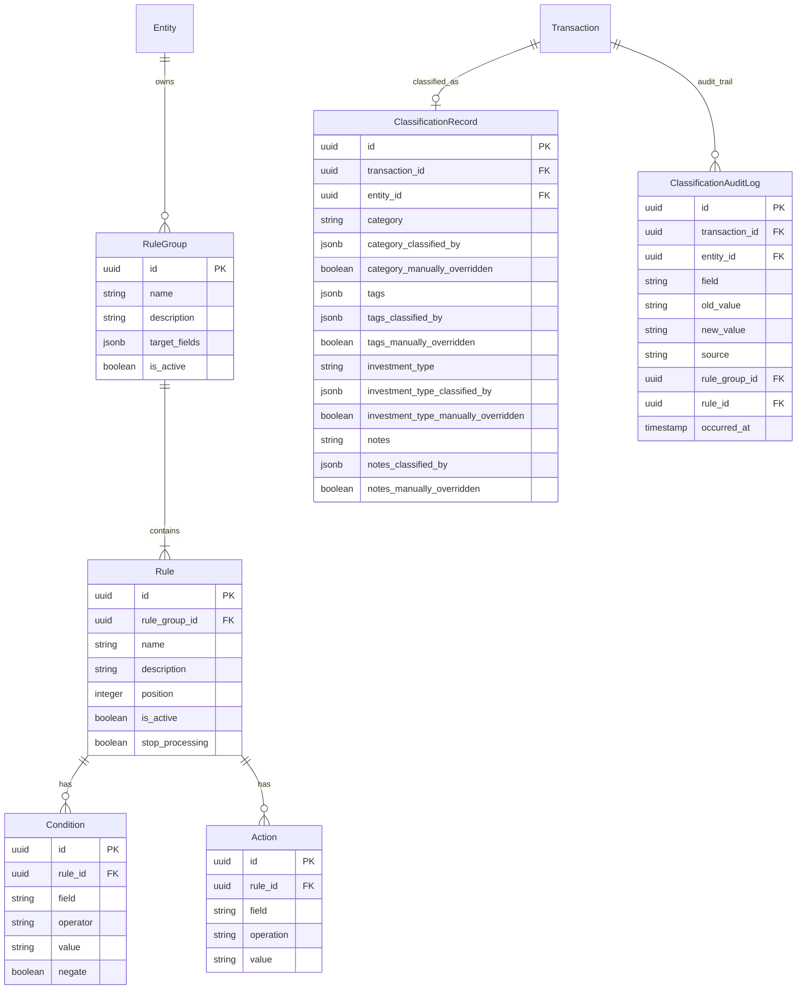

# ADR 0011: Rules Engine Data Model

- Status: Accepted
- Date: 2026-03-05
- Decision Makers: Maintainer(s)
- Phase: 2 — Architecture & System Design
- Source: `llms/tasks/002_architecture_system_design/plan.md` (Steps 4+5, DP-5)

## Context

ADR-0003 established that AurumFinance uses a grouped rules engine: multiple
independent rule groups fire per transaction, with first-match-wins priority
within each group. ADR-0004 established the immutable facts / mutable
classification split, with manual override protection via `classified_by` and
`manually_overridden` flags.

This ADR defines the concrete data model for storing and evaluating rule
groups, rules, conditions, and actions. It also specifies how classification
provenance is recorded, how manual overrides interact with rule evaluation,
the approach to rule versioning, and the performance strategy for bulk
evaluation.

ADR-0007 placed rules and classification in the `AurumFinance.Classification`
context (Tier 2), depending on `Entities` (Tier 0) and `Ledger` (Tier 1).
ADR-0010 defines the ingestion pipeline that invokes Classification — the
pipeline is the caller; Classification is the service.

### Inputs

- ADR-0003: Grouped rules engine with per-group priority and explainability.
- ADR-0004: Immutable facts vs mutable classification with manual override
  protection.
- ADR-0007: Bounded context boundaries. Classification is Tier 2; depends on
  Ledger and Entities.
- ADR-0008: Ledger schema design. Transaction and Posting fields that rules
  evaluate against.
- ADR-0009: Multi-entity ownership model. Rule groups are global; entity
  attributes are available as condition fields.
- ADR-0010: Ingestion pipeline architecture (designed jointly with this ADR).
- Phase 1: Firefly III's trigger/condition/action pipeline as a validated
  pattern.

## Decision Drivers

1. Multiple independent classification dimensions must operate simultaneously
   on the same transaction without conflict (ADR-0003).
2. Rule conditions must be expressive enough to match common bank statement
   patterns (string matching, numeric comparison, emptiness checks).
3. Actions must be structured field assignments, not arbitrary code —
   predictable, auditable, and safe.
4. Every automated classification must record its provenance: which group,
   which rule, which fields were set (ADR-0003).
5. Manual user edits must be protected from rule re-runs (ADR-0004).
6. Rule evaluation must be efficient for bulk imports (hundreds of transactions
   per import batch).

## Decision

### 1. Rule Group and Rule Entity Structures

#### RuleGroup

A rule group represents an independent classification dimension. Each group
is responsible for setting one or more specific classification fields.

| Field | Description | Mutability |
|-------|-------------|------------|
| id | Primary key (UUID) | Immutable |
| name | Display name (e.g., "Expense Category", "Account Tags") | Mutable |
| description | Optional description of the group's purpose | Mutable |
| target_fields | List of classification field names this group is responsible for (e.g., `["category"]` or `["tags"]`) | Mutable |
| is_active | Whether this group is evaluated during classification | Mutable |
| inserted_at | Creation timestamp | Immutable |
| updated_at | Last modification timestamp | Auto |

**Rules for RuleGroup:**

- Each group declares its `target_fields` — the classification fields it is
  allowed to set. This makes the group's responsibility explicit and prevents
  conflicts between groups.
- Groups with overlapping `target_fields` are permitted but discouraged. If
  two groups both target `category`, the result depends on merge order
  (undefined, since groups run in parallel). This is documented as a
  configuration choice, not an error.
- Groups are independent dimensions (ADR-0003) and are evaluated in
  parallel. There is no group-level ordering. Only Rule ordering (within a
  group) is significant.
- Inactive groups are skipped during evaluation.

#### Rule

A rule is a single condition-action pair within a group. It specifies: "if
these conditions match, apply these actions."

| Field | Description | Mutability |
|-------|-------------|------------|
| id | Primary key (UUID) | Immutable |
| rule_group_id | Parent group | Immutable |
| name | Display name (e.g., "Uber rides", "Salary deposits") | Mutable |
| description | Optional description | Mutable |
| position | Priority within the group (integer, ascending; lower = higher priority) | Mutable |
| is_active | Whether this rule is evaluated | Mutable |
| stop_processing | If true, skip remaining rules in this group after this rule matches (default: true, implementing first-match-wins) | Mutable |
| inserted_at | Creation timestamp | Immutable |
| updated_at | Last modification timestamp | Auto |

**Rules for Rule:**

- Within a group, rules are evaluated in `position` order (ascending).
- When `stop_processing` is true (the default), the first matching rule in
  the group wins and remaining rules are skipped. This implements the
  "first match wins" behavior from ADR-0003.
- Setting `stop_processing` to false allows a rule to apply its actions and
  continue evaluating subsequent rules. This is an advanced feature for
  cases where multiple rules should contribute to the same group's output
  (e.g., additive tags).
- Inactive rules are skipped during evaluation.

### 2. Condition Model

Conditions define when a rule matches a transaction. A rule has zero or more
conditions, composed with AND logic by default.

#### Condition Entity

| Field | Description | Mutability |
|-------|-------------|------------|
| id | Primary key (UUID) | Immutable |
| rule_id | Parent rule | Immutable |
| field | The transaction/posting field to evaluate (see supported fields) | Mutable |
| operator | The comparison operator (see supported operators) | Mutable |
| value | The comparison value (stored as string; interpreted based on field type) | Mutable |
| negate | If true, the condition matches when the operator does NOT match (logical NOT) | Mutable |
| inserted_at | Creation timestamp | Immutable |
| updated_at | Last modification timestamp | Auto |

#### Composition Logic

- **Within a rule:** All conditions are composed with AND. A rule matches only
  if ALL its conditions match. This follows the principle of least surprise
  and matches Firefly III's validated pattern.
- **A rule with zero conditions** always matches. This is useful as a
  "catch-all" or "default" rule placed last in a group.
- **OR logic** is achieved by creating multiple rules in the same group. Each
  rule represents one OR branch. Since the group evaluates rules in priority
  order (first match wins), this naturally models OR.
- **NOT logic** is achieved via the `negate` flag on individual conditions.

Example — "description contains UBER OR description contains CABIFY":

```
Group: Expense Category
  Rule 1 (position: 1): description contains "UBER" -> category = Transport
  Rule 2 (position: 2): description contains "CABIFY" -> category = Transport
```

Both rules produce the same action. The first match wins, achieving OR.

#### Supported Fields

Conditions can reference these transaction and posting fields:

| Field name | Source | Type | Description |
|------------|--------|------|-------------|
| `description` | Transaction | string | Original transaction description |
| `memo` | Transaction | string | Transaction memo/notes |
| `amount` | Posting | decimal | Posting amount (signed) |
| `abs_amount` | Posting | decimal | Absolute value of posting amount |
| `currency_code` | Posting | string | Currency of the posting |
| `date` | Transaction | date | Transaction date |
| `source_type` | Transaction | string | How the transaction was created (import/manual/system) |
| `account_name` | Account | string | Name of the posting's target account |
| `account_type` | Account | string | Type of the posting's target account |
| `entity_name` | Entity | string | Name of the owning entity |
| `entity_slug` | Entity | string | Slug of the owning entity |
| `entity_type` | Entity | string | Type of the owning entity (individual/legal_entity/trust/other) |
| `entity_country_code` | Entity | string | Country code of the owning entity |
| `institution_name` | Account | string | Institution name of the posting's target account |

**Note on posting context:** When a transaction has multiple postings (splits),
conditions referencing posting fields (`amount`, `currency_code`,
`account_name`, `account_type`) are evaluated against each posting
independently. If any posting satisfies all conditions, the rule matches. The
classification is applied to the transaction level, not to individual postings.

**Extensibility:** New fields can be added by extending the field name
enumeration and implementing the field resolver. No schema changes are needed
to the Condition table itself.

#### Supported Operators

| Operator | Applicable types | Description |
|----------|-----------------|-------------|
| `equals` | string, decimal, date | Exact match (case-insensitive for strings) |
| `contains` | string | Substring match (case-insensitive) |
| `starts_with` | string | Prefix match (case-insensitive) |
| `ends_with` | string | Suffix match (case-insensitive) |
| `matches_regex` | string | Regular expression match |
| `greater_than` | decimal, date | Greater than comparison |
| `less_than` | decimal, date | Less than comparison |
| `greater_than_or_equal` | decimal, date | Greater than or equal |
| `less_than_or_equal` | decimal, date | Less than or equal |
| `is_empty` | string | Field is null or empty string (value field is ignored) |
| `is_not_empty` | string | Field is not null and not empty string (value field is ignored) |

**Operator extensibility:** New operators can be added by implementing the
operator evaluation function. The operator name is stored as a string, not a
database enum, to allow extension without migration.

**Type coercion:** The `value` field is always stored as a string. During
evaluation, it is coerced to the appropriate type based on the `field`'s type.
For example, if `field` is `amount` and `operator` is `greater_than`, `value`
is parsed as a decimal. If parsing fails, the condition does not match (fails
safe).

### 3. Action Model

Actions define what a rule does when it matches. A rule has one or more
actions. Each action sets a specific classification field to a value.

#### Action Entity

| Field | Description | Mutability |
|-------|-------------|------------|
| id | Primary key (UUID) | Immutable |
| rule_id | Parent rule | Immutable |
| field | The classification field to set (see target fields) | Mutable |
| operation | How the value is applied (see operations) | Mutable |
| value | The value to set (stored as string; interpreted based on field) | Mutable |
| inserted_at | Creation timestamp | Immutable |
| updated_at | Last modification timestamp | Auto |

#### Target Fields

Actions can set these classification fields:

| Field name | Type | Description |
|------------|------|-------------|
| `category` | string | Transaction category (e.g., "Transport", "Groceries") |
| `tags` | list of strings | Transaction tags |
| `investment_type` | string | Investment classification (e.g., "ETF", "Bond") |
| `notes` | string | Classification notes / friendly description |

**Extensibility:** New classification fields can be added by extending the
field name enumeration. The Action table schema does not change.

#### Operations

| Operation | Applicable fields | Description |
|-----------|------------------|-------------|
| `set` | category, investment_type, notes | Replace the field value entirely |
| `add` | tags | Add the value to the existing list (additive, no duplicates) |
| `remove` | tags | Remove the value from the existing list |
| `append` | notes | Append the value to existing notes (separated by newline) |

**Why not arbitrary code?** Actions are structured field assignments — they
can only set classification fields to declared values using declared
operations. This ensures that rules are predictable, auditable, and safe.
There is no expression language, no scripting, and no ability for a rule to
modify transaction facts.

### 4. `classified_by` Provenance Recording

Every classification outcome is recorded in a `ClassificationRecord` that
links a transaction to its classification values and their provenance.

#### ClassificationRecord

| Field | Description | Mutability |
|-------|-------------|------------|
| id | Primary key (UUID) | Immutable |
| transaction_id | The classified transaction | Immutable |
| entity_id | Owning entity (denormalized for query performance) | Immutable |
| category | Classified category value | Mutable |
| category_classified_by | Provenance for category (see below) | Mutable |
| category_manually_overridden | Whether user has manually set this field | Mutable |
| tags | Classified tags (list of strings) | Mutable |
| tags_classified_by | Provenance for tags | Mutable |
| tags_manually_overridden | Whether user has manually set this field | Mutable |
| investment_type | Classified investment type | Mutable |
| investment_type_classified_by | Provenance for investment_type | Mutable |
| investment_type_manually_overridden | Whether user has manually set this field | Mutable |
| notes | Classification notes | Mutable |
| notes_classified_by | Provenance for notes | Mutable |
| notes_manually_overridden | Whether user has manually set this field | Mutable |
| inserted_at | Creation timestamp | Immutable |
| updated_at | Last modification timestamp | Auto |

**One ClassificationRecord per Transaction:** There is exactly one
ClassificationRecord per transaction. If no classification has been applied
(no rules matched, no manual edit), the record may not exist or may exist
with all fields null.

#### Provenance Format

The `*_classified_by` fields store a JSON map indicating who or what set
the value:

**Rule-based classification:**
```json
{
  "source": "rule",
  "rule_group_id": "uuid-of-group",
  "rule_id": "uuid-of-rule",
  "classified_at": "2026-03-05T10:30:00Z"
}
```

**Manual user classification:**
```json
{
  "source": "user",
  "classified_at": "2026-03-05T11:00:00Z"
}
```

**Unclassified (no rules matched, no manual edit):**
The `*_classified_by` field is null.

### 5. `manually_overridden` Interaction with Rule Evaluation

The `manually_overridden` flag protects user edits from being overwritten by
rule re-runs. The interaction follows these rules:

**During rule evaluation (classify_transaction):**

```
for each rule group:
  find the first matching rule (by position)
  for each action in the matched rule:
    target_field = action.field
    if classification_record[target_field + "_manually_overridden"] == true:
      SKIP this action (do not overwrite user edit)
    else:
      apply the action
      set classified_by to {source: "rule", rule_group_id: ..., rule_id: ...}
```

**When a user manually edits a classification field:**

1. The field value is updated.
2. `*_classified_by` is set to `{source: "user", classified_at: ...}`.
3. `*_manually_overridden` is set to `true`.

**When a user clears a manual override:**

1. `*_manually_overridden` is set to `false`.
2. The field value is NOT cleared — it retains its current value.
3. On the next rule evaluation (manual re-run or re-import), rules can
   overwrite this field again.

**Re-classification (re-running rules on existing transactions):**

The `classify_transactions/1` function (batch re-run) evaluates all active
rule groups against the provided transactions. For each transaction:
- Fields with `manually_overridden: true` are skipped.
- Fields without manual override are re-evaluated and updated.
- The classification audit log records the change (old value, new value,
  source).

### 6. Classification Audit Log

Every classification change is recorded in a `ClassificationAuditLog` for
explainability and debugging.

#### ClassificationAuditLog Entity

| Field | Description | Mutability |
|-------|-------------|------------|
| id | Primary key (UUID) | Immutable |
| transaction_id | The affected transaction | Immutable |
| entity_id | Owning entity (denormalized) | Immutable |
| field | The classification field that was changed (e.g., "category") | Immutable |
| old_value | Previous value (null if first classification) | Immutable |
| new_value | New value | Immutable |
| source | Who/what made the change: "rule" or "user" | Immutable |
| rule_group_id | If source is "rule", which group | Immutable |
| rule_id | If source is "rule", which rule | Immutable |
| occurred_at | When the change happened | Immutable |
| inserted_at | Creation timestamp | Immutable |

**The audit log is append-only.** Entries are never modified or deleted. This
provides a complete history of every classification change for a transaction.

### 7. Rule Versioning and Historical Classifications

**Rules are mutable.** Rule names, conditions, actions, and priorities can be
changed at any time. There is no rule versioning at the schema level.

**Historical classifications reference rules by ID, not by content.** The
`classified_by` provenance records `rule_group_id` and `rule_id`. If a rule
changes after a transaction was classified, the provenance still points to the
same rule ID. Looking up that rule shows its *current* state, not its state at
the time of classification.

**Why no rule versioning?**

- For a personal finance system, rule changes are infrequent and made by the
  single operator who understands their own intent.
- Rule versioning would add significant complexity: version history tables,
  snapshot-on-write logic, and UI to navigate rule versions.
- The audit log provides sufficient historical context: it records *what
  changed* (old value -> new value), *which rule applied* (by ID), and *when*.
  If the operator needs to understand why a classification was made, the audit
  log answers that question.
- If a rule change has unintended consequences, the operator can re-run
  classification on affected transactions, and the audit log will record the
  correction.

**Impact of rule changes:**

- Changing a rule does NOT automatically re-classify existing transactions.
  Re-classification is an explicit action (triggered by the user or by a
  re-import).
- When re-classification runs, it applies the current rule state to existing
  transactions, respecting manual overrides.
- The audit log preserves the full history: the original classification
  (rule at the time), the re-classification (rule in its current state), and
  any manual corrections.

### 8. Performance Strategy for Bulk Evaluation

Rule evaluation happens in-process — no job queue, no background workers for
the rules themselves. The pipeline batches transactions before invoking the
rules engine.

**Evaluation strategy:**

```
Given: N transactions to classify, G active rule groups, R rules per group

1. Load all active rule groups for the entity (with their rules, conditions,
   and actions) into memory. This is a single query with preloaded associations.

2. For each transaction (or batch of transactions):
   a. For each active group (in parallel — groups are independent):
      - For each active rule in the group (in position order):
        - Evaluate all conditions against the transaction
        - If all conditions match:
          - Apply actions (respecting manually_overridden)
          - If stop_processing: break to next group
      - If no rule matched: record no-match for this group
   b. Write the ClassificationRecord (upsert)
   c. Write ClassificationAuditLog entries for any changes

3. All writes are batched into bulk inserts/upserts for efficiency.
```

**Performance characteristics:**

- **Rule loading:** Rules are loaded once per classification batch, not per
  transaction. For a typical entity with 5-20 groups and 10-50 rules per
  group, this is a trivial query.
- **Evaluation complexity:** O(N * G * R * C) where N = transactions, G =
  groups, R = max rules per group, C = max conditions per rule. For personal
  finance volumes (N = hundreds per import, G = 5-20, R = 10-50, C = 3-5),
  this is well within in-process performance bounds.
- **Write batching:** ClassificationRecord upserts and audit log inserts are
  batched using `Ecto.Multi` or `Repo.insert_all` to minimize database
  round-trips.
- **No caching between runs:** Rules are loaded fresh for each classification
  batch. Since rules can change between runs, caching would introduce
  staleness risk for negligible performance gain at this scale.

**When performance becomes a concern:**

If an entity accumulates thousands of rules or needs to re-classify millions
of transactions, the following optimizations can be considered without
changing the data model:

- Pre-filter rules by target account or source_type to reduce the rule set
  evaluated per transaction.
- Compile regex patterns once per batch rather than per-transaction.
- Parallelize evaluation across groups (since groups are independent).

These are implementation optimizations, not design changes.

## Rationale

### Why per-field classified_by and manually_overridden?

Per-field provenance and override flags provide the finest granularity of
control. A user might accept the rule-assigned category but override the tags.
Per-field tracking makes this possible without all-or-nothing override
semantics.

### Why JSON for classified_by instead of separate columns?

The provenance structure is small and its content varies by source type (rule
vs user). A JSON map is more expressive and extensible than separate columns
for every possible provenance attribute. The tradeoff is that JSON fields
cannot be indexed as efficiently, but provenance lookups (e.g., "find all
transactions classified by rule X") are infrequent analytical queries, not
hot-path operations.

### Why AND-only composition within a rule?

AND composition is the simplest and most intuitive model: "match if ALL
conditions are true." OR logic is naturally expressed by creating multiple
rules with the same actions. This avoids the complexity of nested boolean
expressions (AND/OR trees) while remaining fully expressive. Firefly III
validates this pattern — its rules use AND composition with separate rules
for OR branches.

### Why a flat condition list instead of a condition tree?

A condition tree (nested AND/OR groups) is more powerful but significantly
more complex to build, store, display, and debug. The flat AND list with
OR-via-multiple-rules is sufficient for personal finance classification
patterns and is easier for the operator to reason about.

### Why stop_processing defaults to true?

First-match-wins is the expected behavior described in ADR-0003 and is the
most intuitive model for rule priority. The `stop_processing` flag exists
as an escape hatch for advanced use cases (e.g., additive tag rules where
multiple rules should contribute), but the default enforces the core
ADR-0003 contract.

## Consequences

### Positive

- The grouped model (ADR-0003) is fully realized in the data model with
  explicit group responsibilities via `target_fields`.
- Conditions are expressive enough for common bank statement patterns without
  requiring a scripting language.
- Actions are structured and predictable — no arbitrary code execution.
- Per-field provenance and manual override tracking provides fine-grained
  control and full auditability.
- The audit log provides a complete history of classification changes for
  debugging and explainability.
- Rule evaluation is efficient for personal finance volumes without requiring
  background processing or caching infrastructure.
- The model is extensible: new condition fields, operators, action operations,
  and classification fields can be added without schema changes to the core
  tables.

### Negative / Trade-offs

- Per-field `classified_by` and `manually_overridden` columns on
  ClassificationRecord create a wide table. For N classification fields,
  there are 3N columns (value, classified_by, manually_overridden).
- No rule versioning means that looking up a rule ID from a historical
  classification shows the rule's current state, not its state when it was
  applied.
- AND-only composition within a rule means that complex boolean logic
  requires multiple rules, which can make some rule sets verbose.
- The `stop_processing` flag (defaulting to true) means that operators must
  understand rule priority within a group.

### Mitigations

- The wide ClassificationRecord table is manageable because the number of
  classification fields is small and grows slowly (currently 4: category,
  tags, investment_type, notes).
- The audit log compensates for lack of rule versioning by recording what
  actually happened (old value, new value, rule ID, timestamp).
- The UI should provide clear visualization of rule priority within groups
  and support drag-and-drop reordering.
- The preview mode (ADR-0003, ADR-0010) lets operators experiment with rule
  configurations before applying them.

## Implementation Notes

- All classification entities live under `AurumFinance.Classification`
  (ADR-0007).
- The Classification context owns: RuleGroup, Rule, Condition, Action,
  ClassificationRecord, ClassificationAuditLog.
- All classification entities are entity-scoped (carry `entity_id` directly
  or inherit it through the rule group).
- `classified_by` fields are stored as JSONB columns (PostgreSQL).
- `tags` on ClassificationRecord is stored as a JSONB array of strings.
- `target_fields` on RuleGroup is stored as a JSONB array of strings.
- Operator names (on Condition) and operation names (on Action) are stored as
  strings, not database enums, to allow extension without migration.
- The `position` field on Rule is an integer. Reordering is done by updating
  position values. No fractional ordering or linked-list model. RuleGroup has
  no position — groups are evaluated in parallel.
- ClassificationAuditLog is an append-only table with no update or delete
  operations exposed through the context API.
- The `classify_transaction/1` function is the primary entry point for
  single-transaction classification. `classify_transactions/1` is the bulk
  entry point used by the ingestion pipeline (ADR-0010).
- `preview_classification/1` evaluates rules without writing to the database
  and returns a `ClassificationPreview` struct showing proposed changes.

### Entity Relationship Diagram



### Relationship to Other ADRs

- **ADR-0003:** This ADR implements the grouped rules engine model. The group
  concept, first-match-wins behavior, explainability requirements, and
  preview-before-apply mode are all realized in the data model.
- **ADR-0004:** The fact/classification split is enforced structurally.
  Conditions read immutable fact fields (Transaction, Posting). Actions write
  mutable classification fields (ClassificationRecord). Rules cannot modify
  facts. Manual override protection is implemented via per-field
  `manually_overridden` flags.
- **ADR-0007:** All entities defined here live within
  `AurumFinance.Classification`. Classification depends on Ledger (Tier 1)
  for reading transaction/posting data. It does not depend on Ingestion —
  the pipeline calls Classification, not the reverse.
- **ADR-0008:** Conditions reference Transaction and Posting fields defined in
  ADR-0008 (`description`, `date`, `amount`, `currency_code`, `source_type`).
  ClassificationRecord references Transaction by ID.
- **ADR-0009:** Rule groups are global (no `entity_id`). Entity specificity is
  achieved through condition fields (`entity_name`, `entity_slug`,
  `entity_type`, `entity_country_code`). ClassificationRecord and
  ClassificationAuditLog remain entity-scoped (they record results per
  transaction, which are entity-scoped via Ledger).
- **ADR-0010:** The ingestion pipeline invokes Classification through two
  entry points: `preview_classification/1` (during import preview) and
  `classify_transaction/1` (during import commit). The pipeline batches
  transactions and calls `classify_transactions/1` for bulk evaluation.
