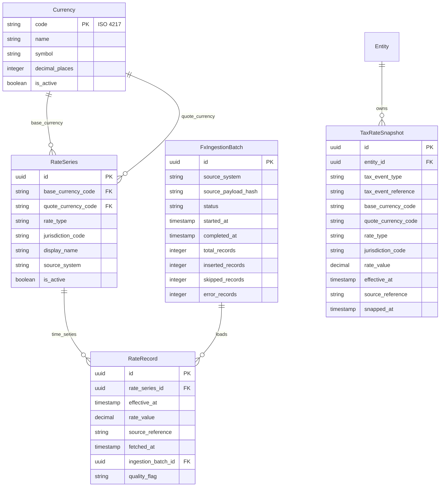

# ADR 0012: FX Rate Storage and Lookup Model

- Status: Accepted
- Date: 2026-03-05
- Decision Makers: Maintainer(s)
- Phase: 2 — Architecture & System Design
- Source: `llms/tasks/002_architecture_system_design/plan.md` (Step 6, DP-6)

## Context

ADR-0005 established the high-level multi-jurisdiction FX posture:

- original transaction values are immutable in the ledger,
- currency conversions are derived on read,
- multiple named rate series can exist for the same currency pair,
- tax-relevant conversions must use immutable snapshots.

This ADR defines the concrete ExchangeRates data model and lookup semantics:
rate series identity, rate record structure, tax snapshot immutability, lookup
API behavior, missing-rate handling, and bulk ingestion of historical rates.

ADR-0007 placed ExchangeRates in Tier 1 (`AurumFinance.ExchangeRates`) with
dependencies only on `Entities` for tax snapshot ownership. ADR-0009 defined
fiscal residency and default tax rate type at the entity level. This ADR
connects those decisions into a complete model.

### Inputs

- ADR-0005: Multi-jurisdiction FX model with named rate series and immutable
  tax snapshots.
- ADR-0007: Bounded context boundaries (`ExchangeRates` in Tier 1).
- ADR-0008: Ledger stores originals only; conversions are read-time concerns.
- ADR-0009: Fiscal residency and default tax rate type are entity properties.
- Phase 1 references: GnuCash trading-account correctness for cross-currency
  balancing, extended here with jurisdiction-aware rate series.

## Decision Drivers

1. A single currency pair must support multiple legally/operationally distinct
   rates without schema changes.
2. Tax event FX snapshots must remain immutable even if historical rate series
   are corrected later.
3. Rate lookup behavior must be deterministic and explicit (no hidden
   interpolation).
4. Missing-rate behavior must be caller-controlled and auditable.
5. Historical rate backfills must be loadable efficiently and idempotently.
6. ExchangeRates must remain implementation-agnostic and not force enum-based
   rate types or jurisdictions.

## Decision

### 0. Currency Entity

`AurumFinance.ExchangeRates` owns the canonical currency registry. Currencies
are global data — shared across all entities on the instance.

#### Currency Entity

| Field | Description | Mutability |
|-------|-------------|------------|
| code | ISO 4217 currency code (e.g., `"USD"`, `"BRL"`, `"ARS"`) — primary key | Immutable |
| name | Full currency name (e.g., `"US Dollar"`) | Mutable |
| symbol | Currency symbol (e.g., `"$"`, `"R$"`) | Mutable |
| decimal_places | Number of minor-unit decimal places (e.g., 2 for USD, 0 for JPY) | Mutable |
| is_active | Whether this currency is available for account and rate selection | Mutable |
| inserted_at | Creation timestamp | Immutable |

Currency `code` is the natural primary key and the foreign-key value used
throughout the system (`currency_code` columns on Account, Posting,
RateSeries, etc.). No UUID primary key is used for Currency — the ISO code is
stable and sufficient.

### 1. Rate Series Identity

Rate series are identified by a composite natural key:

`(base_currency_code, quote_currency_code, rate_type, jurisdiction_code)`

Where:
- `base_currency_code` is the source currency,
- `quote_currency_code` is the target currency,
- `rate_type` is an arbitrary string key (e.g., `official_tax`, `market`,
  `parallel`, `sii_official`, `sunat_official`),
- `jurisdiction_code` is optional and represented as an ISO country code or
  `global` when the series is not jurisdiction-specific.

#### RateSeries Entity

| Field | Description | Mutability |
|-------|-------------|------------|
| id | Primary key (UUID) | Immutable |
| base_currency_code | Source currency ISO code | Immutable |
| quote_currency_code | Target currency ISO code | Immutable |
| rate_type | String key for the series purpose/type | Immutable |
| jurisdiction_code | Country code or `global` scope | Immutable |
| display_name | Human-friendly label | Mutable |
| description | Optional free text | Mutable |
| source_system | Provider or authority name | Mutable |
| is_active | Whether this series is available for lookup | Mutable |
| inserted_at | Creation timestamp | Immutable |
| updated_at | Last modification timestamp | Auto |

### 2. Rate Record Structure

Rate records are append-only data points inside a rate series.

#### RateRecord Entity

| Field | Description | Mutability |
|-------|-------------|------------|
| id | Primary key (UUID) | Immutable |
| rate_series_id | Parent series | Immutable |
| effective_at | Timestamp when the rate becomes effective (UTC) | Immutable |
| rate_value | Decimal conversion value (quote per 1 base) | Immutable |
| source_reference | Source URL, bulletin id, or provider record id | Immutable |
| fetched_at | Timestamp when AurumFinance fetched/loaded the rate | Immutable |
| ingestion_batch_id | Optional id linking to bulk ingestion run | Immutable |
| quality_flag | Optional marker (`official`, `estimated`, `manual`) | Immutable |
| inserted_at | Persistence timestamp | Immutable |

#### Granularity

- The model supports daily and intraday rates through `effective_at`.
- Daily feeds use canonical midday/close timestamps as provider-defined.
- No interpolation values are stored; only source-provided records are stored.

### 3. Tax Snapshot Immutability

Tax snapshots are entity-scoped, write-once records attached to tax-relevant
events (not to mutable reports).

#### TaxRateSnapshot Entity

| Field | Description | Mutability |
|-------|-------------|------------|
| id | Primary key (UUID) | Immutable |
| entity_id | Owning entity | Immutable |
| tax_event_type | Event category (`asset_sale`, `dividend`, etc.) | Immutable |
| tax_event_reference | Stable reference to the source event | Immutable |
| base_currency_code | Source currency | Immutable |
| quote_currency_code | Target/tax currency | Immutable |
| rate_type | Selected rate type at snapshot time | Immutable |
| jurisdiction_code | Jurisdiction used for selection | Immutable |
| rate_value | Frozen rate value | Immutable |
| effective_at | Effective timestamp of the underlying rate | Immutable |
| source_reference | Snapshot source metadata | Immutable |
| snapped_at | Timestamp snapshot was created | Immutable |

#### Immutability Rules

1. A snapshot cannot be updated after insertion.
2. A snapshot cannot be deleted while its referenced tax event exists.
3. Snapshot identity is unique per `(entity_id, tax_event_reference)`.
4. Recomputing reports never rewrites snapshot values; reports read snapshots
   as historical facts.

### 4. Rate Lookup API Semantics

ExchangeRates exposes a deterministic lookup API:

`lookup_rate(base, quote, rate_type, jurisdiction, as_of, strategy)`

Where `strategy` is one of:

- `:exact` — require a record with `effective_at == as_of`.
- `:latest_on_or_before` — pick nearest prior record (`effective_at <= as_of`).
- `:latest_available` — pick newest record regardless of date.

#### Jurisdiction Resolution

1. If caller provides an explicit jurisdiction, use it.
2. If caller is tax workflow and jurisdiction omitted, resolve from entity's
   fiscal residency (ADR-0009).
3. If no jurisdiction-specific series exists and caller allows fallback,
   fallback to `global` jurisdiction for same pair and rate type.

Fallback behavior is opt-in via lookup options; never implicit.

### 5. Missing Rate Handling

Lookup returns a typed result, never silent `nil`:

- `{:ok, rate_record}` when resolved
- `{:error, :rate_not_found}` when no eligible series/record exists
- `{:error, :series_not_found}` when the series identity is absent
- `{:error, :stale_rate}` when caller specifies a max staleness window and the
  nearest prior rate is older than allowed

#### Policy Profiles

Callers choose policy per use case:

- **Tax snapshots:** must use `:exact` or bounded `:latest_on_or_before` with
  strict staleness limits; on missing rate, fail and require user action.
- **General reporting:** typically `:latest_on_or_before`; if missing, caller
  may mark value as unavailable instead of failing the entire report.
- **Dashboard spot views:** may use `:latest_available` for non-audit views.

No interpolation or synthetic rate generation is performed by default.

### 6. Bulk Rate Ingestion Model

Historical and ongoing rates are loaded through append-only ingestion batches.

#### FxIngestionBatch Entity

| Field | Description | Mutability |
|-------|-------------|------------|
| id | Primary key (UUID) | Immutable |
| source_system | Provider/authority name | Immutable |
| source_payload_hash | Hash of source payload/file | Immutable |
| status | `processing`, `completed`, `failed` | Mutable |
| started_at | Start timestamp | Immutable |
| completed_at | Completion timestamp | Mutable |
| total_records | Number of attempted records | Mutable |
| inserted_records | Number of inserted records | Mutable |
| skipped_records | Number of duplicates skipped | Mutable |
| error_records | Number of failed rows | Mutable |

#### Ingestion Rules

1. De-duplication key: `(rate_series_id, effective_at, rate_value,
   source_reference)`.
2. Ingestion is idempotent for the same payload (`source_payload_hash`).
3. Existing RateRecord entries are never updated in place; corrections are
   inserted as new records with corrected `effective_at`/metadata.
4. Ingestion failures are row-level recoverable; batch stores per-row errors.

## Rationale

This model preserves legal and analytical auditability while staying flexible:

- string-based `rate_type` and jurisdiction keys keep the system extensible,
- append-only rate records preserve source history,
- explicit lookup strategies prevent hidden behavior,
- immutable tax snapshots guarantee historical consistency even as rate feeds
  evolve.

It also aligns with the project's immutable-facts posture (ADR-0004) and
entity-scoped fiscal residency defaults (ADR-0009).

## Consequences

### Positive

- Supports any jurisdiction and any named rate type without migrations.
- Provides deterministic, caller-selected lookup semantics.
- Preserves tax defensibility through immutable snapshots.
- Enables high-volume historical backfills with idempotent ingestion.

### Negative / Trade-offs

- Reporting and tax flows must always pass explicit lookup policies.
- Missing-rate handling becomes a first-class UX concern.
- Storage volume grows with append-only rate history.

### Mitigations

- Shared lookup helper APIs in ExchangeRates centralize policy handling.
- Monitoring can detect coverage gaps by pair/type/jurisdiction/date ranges.
- Retention/compression can target raw ingestion payloads, not rate facts.

## Entity Relationship Diagram

## Implementation Notes

- `rate_type` and `jurisdiction_code` are strings, not enums.
- Prefer composite unique constraints on series identity and ingestion
  de-duplication keys.
- Preserve provider metadata (`source_reference`, `fetched_at`) on every record.
- Tax snapshots are write-once columns/records with no update API.
- Currency `code` is the primary key (ISO 4217 string). All other tables
  reference it as a `currency_code` string column, not a UUID foreign key.
