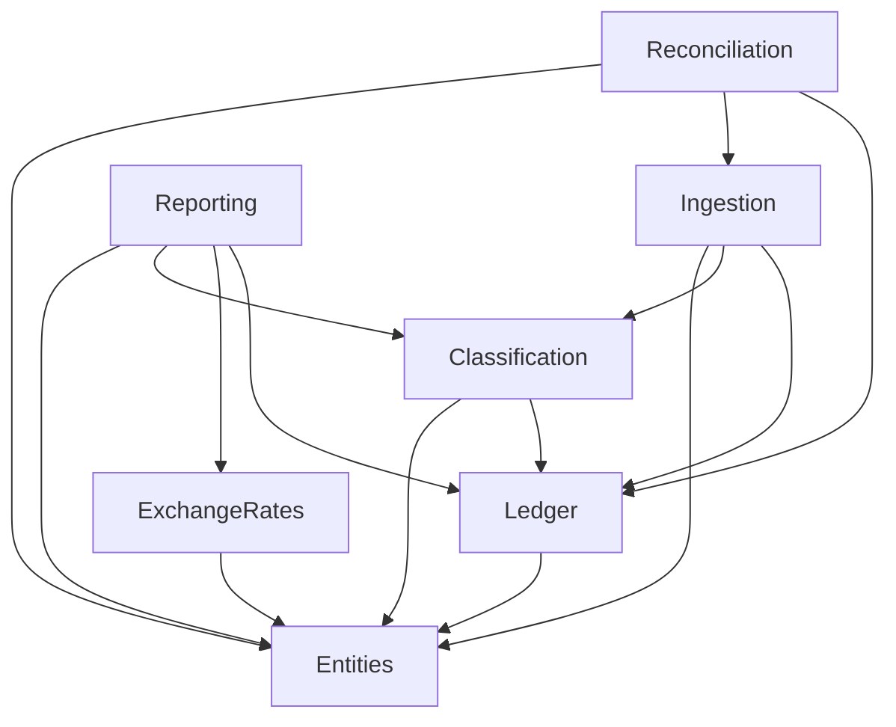
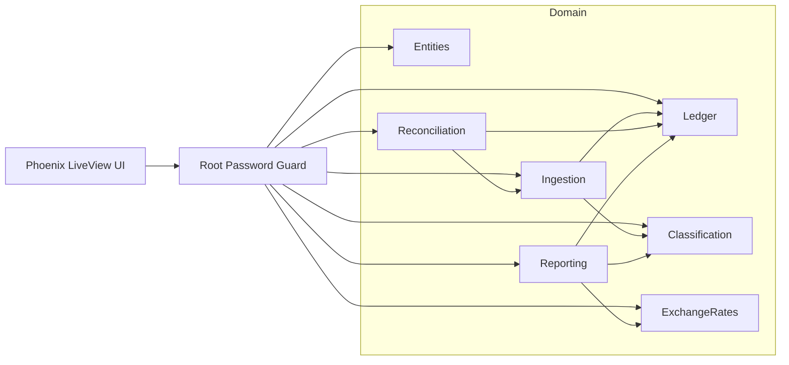
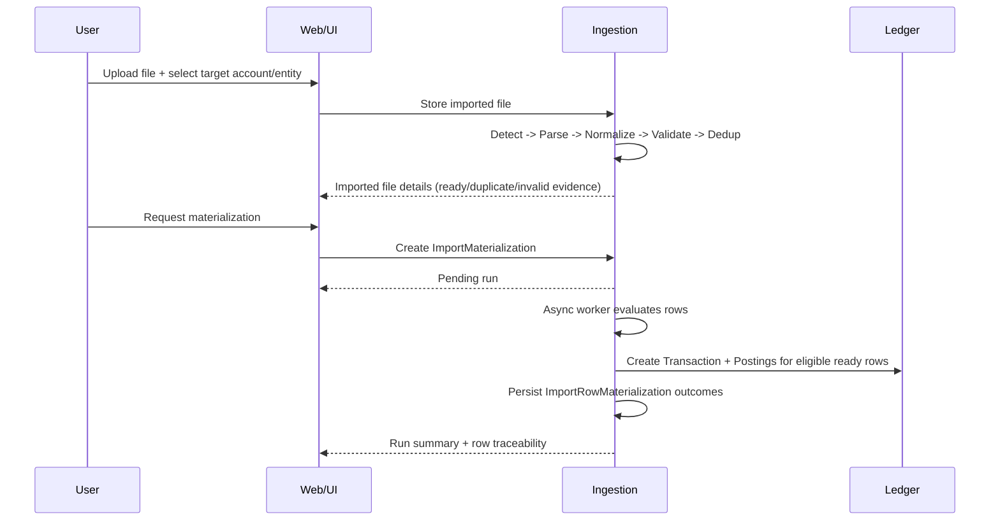
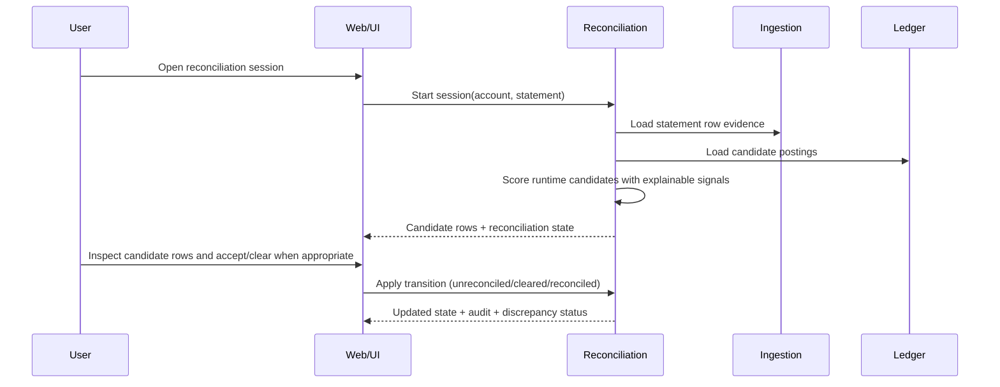
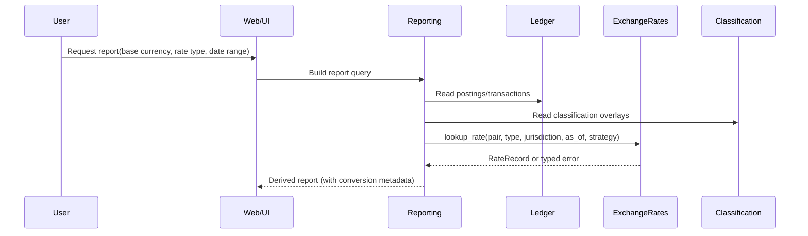

# Architecture

High-level system architecture for AurumFinance.

## Status

Substantive architecture baseline for Phase 2. Context boundaries, dependency
rules, data flows, and cross-cutting invariants are defined. This document is
implementation-free and references accepted ADRs for decision rationale.

## Scope and intent

This architecture defines how AurumFinance is partitioned into bounded contexts
and how data flows across them. It is the integration reference for M1-M6
delivery planning.

Out of scope:
- Ecto schema details, migrations, and code-level APIs
- Infrastructure/deployment topology
- UI implementation details

## Architectural principles

1. Ledger facts are immutable; corrections are append-only (void/reverse/new).
2. Classification is mutable and traceable, separate from immutable facts.
3. Context boundaries are explicit and acyclic (ADR-0007).
4. Entity is the tenant boundary; scoping is column-based (`entity_id`).
5. Cross-currency support is first-class: originals are stored, conversions are
   derived on read (ADR-0005, ADR-0012).
6. Reconciliation overlays workflow state/evidence without mutating facts
   (ADR-0013).
7. Reporting is read-only over core data.

## Context map

### Tiered context model

```
Tier 0 — Foundation
  Entities

Tier 1 — Core Domain
  Ledger
  ExchangeRates

Tier 2 — Orchestration
  Classification
  Ingestion
  Reconciliation

Tier 3 — Analytics (read-only)
  Reporting
```

### Context dependency diagram



### Context responsibilities

| Context | Responsibility | Owns | Scope |
|---|---|---|---|
| `Entities` | Legal/fiscal ownership boundary and residency defaults | Entity | N/A (defines boundary) |
| `Ledger` | Double-entry records and balance derivation | Account, Transaction, Posting, BalanceSnapshot | Entity-scoped |
| `ExchangeRates` | FX series/records, lookup policies, tax snapshots | RateSeries, RateRecord, TaxRateSnapshot, FxIngestionBatch | Mixed (rates global, snapshots entity-scoped) |
| `Classification` | Grouped rules evaluation and mutable overlays | RuleGroup, Rule, Condition, Action, ClassificationRecord, ClassificationAuditLog | Mixed (rules global, outcomes entity-scoped) |
| `Ingestion` | File-to-ledger pipeline and provenance | ImportedFile, ImportedRow, ImportMaterialization, ImportRowMaterialization | Entity-scoped |
| `Reconciliation` | Statement matching and reconciliation lifecycle | ReconciliationSession, MatchResult, Discrepancy, ReconciliationAuditLog | Entity-scoped |
| `Reporting` | Retrospective/projection analytics | Read models (derived) | Entity-scoped + cross-entity aggregates |

## System component view



Notes:
- Authentication is edge-only (not a domain context).
- Context communication is synchronous via public APIs.
- No context depends on `AurumFinanceWeb`.

## Primary data flows

### 1) Import to materialization to posting



Key architecture points:
- imported evidence is immutable and separate from workflow state
- materialization is async and durable before ledger mutation begins
- every evaluated row produces a durable row outcome
- every committed row is traceable file -> imported row -> row outcome -> transaction

### 2) Reconciliation workflow



Key architecture points:
- `reconciled` is explicit confirmation, never automatic.
- Current candidate scoring is assist-only and read-time. It does not persist a
  standalone `MatchResult` entity yet.
- Public candidate inspection surfaces only useful above-threshold candidates by
  default, even though internal scoring can classify more broadly.
- Accepted candidate references are currently preserved through reconciliation
  audit metadata.
- Corrections reopen reconciliation and preserve evidence history.

### 3) Reporting and FX conversion



Key architecture points:
- Conversions are derived on read.
- Missing-rate behavior depends on caller policy (strict tax vs flexible views).

## Cross-cutting invariants

### Data integrity

1. Zero-sum per currency per transaction in Ledger.
2. Ledger facts are immutable after creation.
3. Imported raw evidence is preserved and traceable.
4. Classification cannot mutate transaction/posting facts.
5. Reconciliation state does not alter ledger facts.

### FX and tax integrity

1. Rate series identity is `(base, quote, rate_type, jurisdiction)`.
2. TaxRateSnapshot is write-once and never recomputed.
3. Lookup policy is explicit (`:exact`, `:latest_on_or_before`,
   `:latest_available`).
4. No implicit interpolation of missing rates.

### Multi-entity integrity

1. Entity is the ownership boundary for financial data.
2. Cross-entity operations are explicit and correlated (never implicit merge).
3. Global/shared data is limited to currencies, rates, and rules metadata.

## Operational behavior and failure boundaries

1. Import preview is mandatory; ledger writes occur only through durable materialization runs.
2. Materialization is async and row-traceable; idempotency is enforced through durable row outcomes.
3. Deduplication (ingestion) and reconciliation (statement correctness) are
   separate mechanisms.
4. Missing FX rates are surfaced explicitly to callers as typed errors.
5. Critical reconciliation discrepancies block session closure.

## Milestone alignment

| Milestone | Primary architectural concerns |
|---|---|
| M1 Core Ledger | Entities + Ledger + foundational ExchangeRates |
| M2 Import Pipeline | Ingestion + Reconciliation |
| M3 Rules Engine | Classification depth and explainability |
| M4 Reporting | Read-optimized analytics over existing domains |
| M5 Investments | Ledger extensions for instruments/holdings |
| M6 Tax Awareness | Full FX rate series + tax snapshot workflows |
| M7 AI + MCP | Cross-cutting enhancements on stable foundations |

## ADR index

| ADR | Topic |
|---|---|
| ADR-0002 | Internal double-entry ledger model |
| ADR-0003 | Grouped rules engine |
| ADR-0004 | Immutable facts vs mutable classification |
| ADR-0005 | Multi-jurisdiction FX model |
| ADR-0006 | Retrospective/projection posture |
| ADR-0007 | Bounded context boundaries |
| ADR-0008 | Ledger schema design |
| ADR-0009 | Multi-entity ownership model |
| ADR-0010 | Ingestion pipeline architecture |
| ADR-0011 | Rules engine data model |
| ADR-0012 | FX rate storage and lookup |
| ADR-0013 | Reconciliation workflow model |
| ADR-0014 | Core financial domain model |
| ADR-0015 | Account model and instrument types |
| ADR-0016 | Investment tracking model |
| ADR-0017 | Reporting and read model architecture |
| ADR-0018 | Financial data security boundaries |
