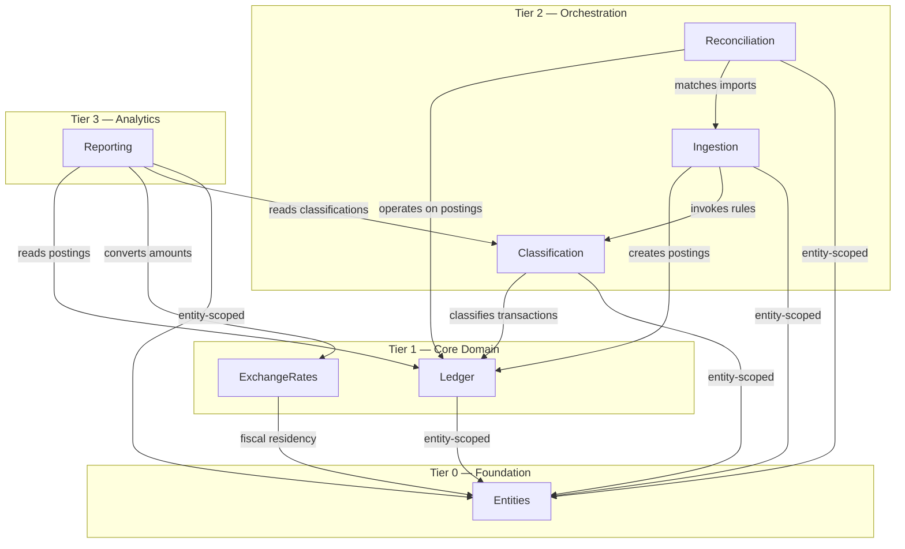
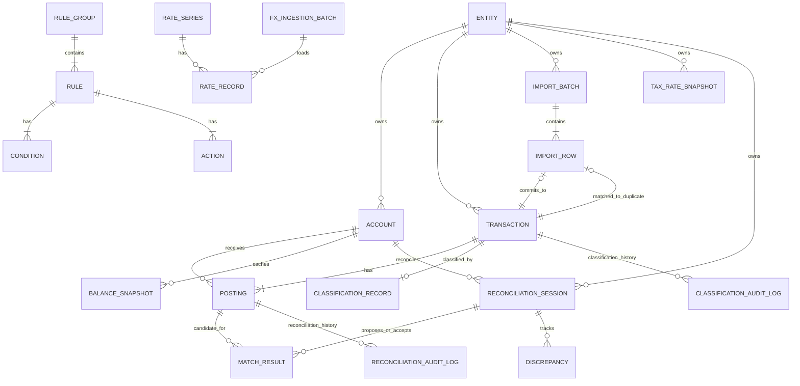

# Domain Model

Core domain entities and relationships for AurumFinance.

## Status

Consolidated Phase 2 domain model baseline (Steps 1-7 complete). All planned
bounded contexts are defined at conceptual level with entities, relationships,
and invariants. Reporting/projection internals remain deferred to M4 planning.

## Modeling principles

- Ledger-style double-entry is the internal source of truth.
- User-facing workflows remain personal-finance oriented (expense, income, transfer, card purchase, card payment).
- Imported statement data is modeled as immutable facts.
- Classification metadata is mutable and correctable by rules and users.
- Classification manual overrides must be preserved across re-runs.
- All financial events remain traceable from source import to final classification.

## Context Map

AurumFinance is partitioned into seven bounded contexts organized in a tiered
dependency structure. Authentication is handled at the edge via a root password
plug — there is no user/accounts context. See ADR-0007 for the full rationale.

### Tier Overview

```
Tier 0 — Foundation (no domain dependencies)
  Entities         — Multi-entity ownership model

Tier 1 — Core Domain (depends on Tier 0 only)
  Ledger           — Accounts, transactions, postings, balances
  ExchangeRates    — FX rate series, rate records, tax snapshots

Tier 2 — Orchestration (depends on Tier 0 + Tier 1)
  Classification   — Rules engine, classification layer, audit
  Ingestion        — Import pipeline, file tracking, deduplication
  Reconciliation   — Statement matching, reconciliation workflow

Tier 3 — Analytics (depends on Tier 0 + Tier 1 + Tier 2, read-only)
  Reporting        — Retrospective analysis, projections, anomalies
```

### Context Map Diagram



### Context Responsibilities Summary

| Context | Owns | Key Invariants | Entity Scope |
|---------|------|---------------|--------------|
| **Entities** | Entity | Tenant boundary for all financial data; fiscal residency fields are columns on Entity; no user model | N/A (defines the boundary) |
| **Ledger** | Account, Transaction, Posting, BalanceSnapshot | Zero-sum per currency per transaction; immutable facts; original currency preserved | Entity-scoped |
| **ExchangeRates** | RateSeries, RateRecord, TaxRateSnapshot, Currency | Tax snapshots immutable; rate types are string keys; arbitrary jurisdictions | Mixed (rates global, snapshots entity-scoped) |
| **Classification** | RuleGroup, Rule, Condition, Action, ClassificationRecord, ClassificationAuditLog | Multiple groups fire per txn; first match wins per group; manual overrides protected | Mixed (rules global, outcomes entity-scoped) |
| **Ingestion** | ImportBatch, ImportRow | Fact/classification split at import; idempotent re-import; preview-before-commit | Entity-scoped |
| **Reconciliation** | ReconciliationSession, MatchResult, Discrepancy | State machine: unreconciled -> cleared -> reconciled; corrections reset state | Entity-scoped |
| **Reporting** | RecurringPattern, Projection, AnomalyAlert | Read-only over primary data; projections labeled with evidence base | Entity-scoped (+ cross-entity) |

### Dependency Rules

1. Dependencies flow strictly downward through tiers.
2. A Tier N context may depend on any Tier 0..N-1 context.
3. No context depends on a context in the same tier (exception: Ingestion depends on Classification, both Tier 2 — this is permitted because Ingestion orchestrates Classification as a downstream step, not a bidirectional dependency).
4. The web layer (`AurumFinanceWeb`) depends on all contexts but no context depends on the web layer.
5. Cross-context communication uses synchronous function calls through public APIs.

### Milestone Alignment

| Milestone | Contexts Built |
|-----------|---------------|
| M1 — Core Ledger | Entities, Ledger, ExchangeRates (currency basics only), Auth (edge plug) |
| M2 — Import Pipeline | Ingestion, Reconciliation |
| M3 — Rules Engine | Classification |
| M4 — Reporting | Reporting |
| M5 — Investments | Extensions to Ledger (instrument types, holdings) |
| M6 — Tax Awareness | ExchangeRates (full rate series, tax snapshots) |
| M7 — AI + MCP | Cross-cutting; no new context expected |

## Core bounded areas

This section defines the conceptual entities and relationships for each
bounded context. It is intentionally implementation-free (no schemas/migrations).

## Domain Entity Relationship Overview



## Lifecycle Summaries

| Domain Area | Primary Lifecycle |
|-------------|-------------------|
| **Ledger transaction** | created -> posted -> voided (with reversing transaction) |
| **Import batch** | uploading -> parsing -> parsed -> previewing -> committed (or failed states) |
| **Classification field** | rule-assigned/user-assigned -> optionally manually overridden -> optionally re-opened for rules |
| **FX snapshot** | created at tax event -> immutable forever |
| **Reconciliation state** | unreconciled -> cleared -> reconciled; corrections reopen to cleared |

### Ledger and Postings

The ledger context (`AurumFinance.Ledger`) is the system of record for all
financial positions. See ADR-0008 for the full design rationale.

#### Entities

| Entity | Description | Key Fields |
|--------|-------------|------------|
| **Account** | A node in the chart of accounts. Forms a tree via adjacency list. This is the canonical internal ledger account abstraction, covering institution-backed accounts, category accounts, and system-managed accounts. | `entity_id`, `parent_account_id`, `account_type` (Asset/Liability/Equity/Income/Expense), `operational_subtype`, `management_group`, `name`, `currency_code`, `is_placeholder`, `is_active` |
| **Transaction** | A single real-world financial event grouping one or more postings. | `entity_id`, `date`, `description`, `memo`, `status` (posted/voided), `correlation_id`, `source_type` (import/manual/system) |
| **Posting** | A single debit or credit line within a transaction, targeting one account. Immutable after creation. | `transaction_id`, `account_id`, `amount` (signed decimal; positive = debit, negative = credit), `currency_code` |
| **BalanceSnapshot** | A cached, non-authoritative balance for an account at a point in time. Derived from postings. | `account_id`, `as_of_date`, `currency_code`, `balance`, `posting_count`, `computed_at` |

#### Relationships

- Entity 1--* Account (entity-scoped)
- Account 1--* Account (parent-child tree; adjacency list)
- Entity 1--* Transaction (entity-scoped)
- Transaction 1--+ Posting (at least two per transaction)
- Posting *--1 Account (each posting targets one account)
- Account 1--* BalanceSnapshot (performance cache)

#### Account Tree

Accounts use a five-type hierarchy (Asset, Liability, Equity, Income, Expense).
Children inherit the type of their parent. The tree is typically 3-5 levels deep
for personal finance. Placeholder accounts serve as organizational nodes that
cannot receive postings.

Not every account corresponds to a bank, broker, or other institution-backed
container. Income/expense categories are also accounts in the ledger model, and
some accounts are system-managed for technical balancing and lifecycle support.
Category accounts may be created manually or introduced automatically by later
categorization workflows; in both cases they remain first-class ledger accounts.

`management_group` is an explicit management/presentation classification used to
support separate account-management surfaces. It does not replace ledger
semantics: `account_type` still carries accounting meaning and
`operational_subtype` still carries operational/institution meaning.

#### Splits

There is no separate "split" entity. A split is simply a transaction with more
than two postings. Example: a grocery receipt divided between "Groceries" and
"Household" creates three postings (one credit to the source account, two debits
to the expense categories).

#### Trading Accounts (Cross-Currency Balancing)

Cross-currency transactions use trading accounts (Equity type, system-managed)
to maintain the zero-sum invariant per currency. A cross-currency transfer
produces four postings — two in the source currency (source account and trading
account) and two in the target currency (trading account and target account).
Trading accounts are created automatically and hidden from normal UX views.

#### Key Invariants

1. **Zero-sum per currency per transaction:** The sum of all posting amounts
   grouped by currency within a transaction must equal zero. Enforced at
   application level (primary) and database level (safety net).
2. **Posting immutability:** Once created, a posting's amount, currency, and
   account cannot be changed. Corrections use void-and-reverse.
3. **Account type inheritance:** A child account must have the same type as its
   parent.
4. **Fact immutability:** Transaction `date`, `description`, and posting
   `amount`/`currency_code` are write-once (ADR-0004).

#### Balance Derivation

Balances are computed on read by summing postings for an account up to a given
date. Balance snapshots provide a performance optimization for accounts with
long histories — queries start from the most recent snapshot and add subsequent
postings. Snapshots are derived artifacts that can be recomputed at any time.

#### Corrections and Voids

The ledger never modifies or deletes existing transactions or postings. A
**void** sets the original transaction's status to `voided` and creates a
reversing transaction with equal-and-opposite postings. A **correction** is a
void followed by a new transaction with corrected postings, linked by
`correlation_id`. Both the original and reversal remain in the ledger
permanently for audit purposes.

#### UX Mapping

Users interact with five personal-finance concepts that map to posting patterns:

| UX Concept | Source Account Type | Target Account Type |
|------------|--------------------|--------------------|
| Expense | Asset or Liability | Expense |
| Income | Income | Asset |
| Transfer | Asset | Asset |
| Credit card purchase | Liability | Expense |
| Credit card payment | Asset | Liability |

Cross-currency variants of any concept automatically include trading-account
postings. The UX layer constructs the full posting set transparently.

The UI may expose different subsets of the same canonical `Account` model
depending on workflow. Institution-backed accounts, category accounts, and
technical/system-managed accounts can be presented in separate views without
changing the ledger model. In implementation, these views are backed by the
explicit `management_group` field rather than temporary query heuristics.

### Multi-Entity Ownership Model

The Entities context (`AurumFinance.Entities`) is the Tier 0 foundation that
defines the tenant boundary for all financial data. See ADR-0009 for the full
design rationale.

#### What is an Entity?

An entity is a legal/fiscal ownership unit — a distinct set of books. Examples:
"Personal", "My LLC", "Family Trust", "Side Project". One operator manages all
entities on the instance.

#### Domain Objects

| Domain Object | Description | Key Fields |
|---------------|-------------|------------|
| **Entity** | A legal/fiscal ownership unit; the tenant boundary for all financial data. | `name`, `type` (individual/legal_entity/trust/other), `country_code`, `tax_identifier` (optional), `fiscal_residency_country_code` (write-default from `country_code` when omitted), `default_tax_rate_type` (optional), `notes` (optional), `archived_at` (soft archive) |

#### Relationships

- Entity 1--* Account (entity-scoped, via Ledger)
- Entity 1--* Transaction (entity-scoped, via Ledger)
- Entity attributes (entity_name, entity_type, entity_country_code) are referenceable as Condition fields in Classification (no foreign key; resolved at evaluation time)
- Entity 1--* ImportBatch (entity-scoped, via Ingestion)
- Entity 1--* ReconciliationSession (entity-scoped, via Reconciliation)
- Entity 1--* TaxRateSnapshot (entity-scoped, via ExchangeRates)

#### Isolation Strategy

All entity-scoped data uses an `entity_id` foreign key column. No schema-level
or database-level separation. Every entity-scoped context function accepts an
entity as the first parameter and filters by `entity_id`.

#### Authentication Is Orthogonal

There is no user model, no `EntityMembership`, no per-entity access control.
Authentication is a root password check at the Phoenix router edge (ADR-0007).
Entity selection is a UI-level concept (session/socket state), not a data
access boundary.

#### Entity-Scoped vs Global Data

| Scope | Data | Rationale |
|-------|------|-----------|
| **Entity-scoped** | Account, Transaction, Posting, BalanceSnapshot, ClassificationRecord, ClassificationAuditLog, ImportBatch, ImportFile, ImportRow, DeduplicationRecord, ReconciliationSession, MatchResult, Discrepancy, TaxRateSnapshot, RecurringPattern, Projection, AnomalyAlert | Financial data belongs to exactly one entity |
| **Global** | Currency, RateSeries, RateRecord, RuleGroup, Rule, Condition, Action | Currencies, exchange rates, and classification rules are shared across entities |

#### Cross-Entity Transfers

Modeled as two correlated transactions — one in each entity — linked by a
shared `correlation_id` (UUID). Each transaction independently satisfies the
zero-sum invariant (ADR-0008). Both are created atomically in a single database
transaction.

#### Cross-Entity Reporting

A read-only aggregation pattern in the Reporting context. Queries across
multiple entities with `WHERE entity_id IN (...)`, aggregates results, and
converts to a single display currency via ExchangeRates. No data is created
or moved.

#### Fiscal Residency per Entity

Fiscal residency is a property of the entity, not the instance. Different
entities can have different fiscal residencies (e.g., "Personal" in Chile,
"My LLC" in Peru). When a tax-relevant event occurs, the entity's
`default_tax_rate_type` determines which rate series to snapshot (ADR-0005).
Existing tax snapshots are immutable regardless of fiscal residency changes.

#### Key Invariants

1. **Every instance has at least one entity.** Created during initial setup.
2. **Entity names are unique** within the instance.
3. **Entities cannot be deleted** — only archived via `archived_at`.
4. **One fiscal residency per entity** — fiscal residency fields
   (`fiscal_residency_country_code`, `default_tax_rate_type`) are columns
   directly on the Entity table; there is no separate fiscal residency record.
5. **No user-entity relationship exists.** The operator owns all entities.
6. **Entity lifecycle changes are audited** via generic `audit_events` entries
   with `entity_type`, `entity_id`, `action`, `actor` (string),
   `channel`, `before`, `after`, and `occurred_at`.

### Ingestion and Normalization

The Ingestion context (`AurumFinance.Ingestion`) manages the import pipeline
from raw file to classified ledger postings. See ADR-0010 for the full design
rationale.

#### Pipeline Overview

Data flows through six sequential stages:

```
Upload & Detect --> Parse & Extract --> Normalize & Validate --> Deduplicate
                                                                     |
                                                                     v
                                                                  Preview
                                                                (user reviews)
                                                                     |
                                                                     v
                                                                   Commit
                                                             (write to Ledger +
                                                              classify via Rules)
```

The **fact/classification split** occurs at the Normalize stage: normalized
values (amount, date, description, currency, institution reference) become
immutable Transaction and Posting fields. Classification is applied after
fact creation and stored separately in ClassificationRecord (ADR-0004).

#### Domain Objects

| Domain Object | Description | Key Fields |
|---------------|-------------|------------|
| **ImportBatch** | A single import operation (one file upload). Tracks the lifecycle from upload to commit. | `entity_id`, `account_id`, `format`, `original_filename`, `file_hash`, `file_size_bytes`, `status`, `total_rows`, `committed_rows`, `error_rows`, `duplicate_rows`, `skipped_rows`, `started_at`, `committed_at` |
| **ImportRow** | A single parsed row from the import file. Preserves raw data for audit. | `import_batch_id`, `row_number`, `raw_data` (JSON), `normalized_data` (JSON), `status`, `error_message`, `dedup_fingerprint`, `matched_transaction_id`, `committed_transaction_id` |

#### Relationships

- Entity 1--* ImportBatch (entity-scoped)
- Account 1--* ImportBatch (target account for the import)
- ImportBatch 1--+ ImportRow (one batch contains many rows)
- ImportRow 0..1--1 Transaction (committed_transaction_id, after commit)
- ImportRow 0..1--1 Transaction (matched_transaction_id, if duplicate)

#### ImportBatch Status Lifecycle

```
:uploading --> :parsing --> :parsed --> :previewing --> :committed
                  |            |                           |
                  v            v                           v
              :parse_failed  :validation_failed       :commit_failed
```

#### Deduplication Strategy

- **Fingerprint:** SHA-256 hash of `(account_id, date, amount, currency_code,
  institution_reference OR description)`. Derived from raw row data only —
  no system-assigned IDs.
- **Scope:** Per account within an entity. Transactions in different accounts
  do not deduplicate against each other.
- **File-level check:** `file_hash` is compared against previously committed
  batches as a soft warning.
- **Conflict resolution:** During preview, the user can skip duplicates
  (default), force import (for genuinely repeated transactions), or replace
  (void existing and import new).

#### Preview-Before-Commit

The preview is mandatory. After Stages 1-4, the user sees all rows with their
statuses (ready, duplicate, error). For ready rows, the system invokes
`Classification.preview_classification/1` to show proposed rule matches.
The user can accept, skip, force, or override before committing. No data is
written to the Ledger until the user approves.

Preview state is persisted in the database (ImportBatch + ImportRow records),
so it survives page reloads and browser disconnects.

#### Commit Atomicity

All writes for a single batch are wrapped in a database transaction. If any
row fails during commit, the entire batch is rolled back. For each approved
row, the pipeline creates a Transaction + Postings in the Ledger (with
`source_type: :import`), invokes Classification, records the dedup
fingerprint, and links the ImportRow to the created Transaction.

#### Format Extensibility

New file formats are added by implementing a `FormatAdapter` behaviour with
three callbacks: `detect/1` (can this adapter handle the file?), `parse/1`
(convert to raw row maps), and `column_mapping/1` (map source columns to
normalized fields). Built-in adapters include CSV (with configurable column
mapping), OFX/QFX, and QIF. Adding a new adapter requires no changes to the
pipeline stages.

#### Key Invariants

1. **Raw data preservation:** `ImportRow.raw_data` is immutable — original
   file data is never modified.
2. **Idempotent import:** Same file imported twice produces no new
   transactions (dedup fingerprint + file hash).
3. **Preview is mandatory:** No data enters the Ledger without user approval.
4. **Full provenance:** File -> batch -> row -> transaction. Every imported
   transaction is traceable to its source row and file.

### Rule Groups and Classification Outcomes

The Classification context (`AurumFinance.Classification`) implements the
grouped rules engine and manages the mutable classification layer. See
ADR-0011 for the full design rationale and ADR-0003 for the engine model.

#### Engine Model

Rules are organized into independent groups. Each group represents a
classification dimension (e.g., expense category, account tags, investment
type). Multiple groups can match the same transaction simultaneously. Within
a group, rules are evaluated in priority order — the first matching rule wins
(controlled by `stop_processing`, which defaults to true).

#### Domain Objects

| Domain Object | Description | Key Fields |
|---------------|-------------|------------|
| **RuleGroup** | An independent classification dimension. Declares which fields it is responsible for. Global — no entity ownership, no ordering (groups run in parallel). | `name`, `description`, `target_fields` (JSON list), `is_active` |
| **Rule** | A single condition-action pair within a group. | `rule_group_id`, `name`, `description`, `position`, `is_active`, `stop_processing` |
| **Condition** | A single condition on a rule. Rules match when ALL conditions match (AND logic). | `rule_id`, `field`, `operator`, `value`, `negate` |
| **Action** | A single field assignment when a rule matches. | `rule_id`, `field`, `operation`, `value` |
| **ClassificationRecord** | The classification state for a transaction. One record per transaction. Per-field provenance and override tracking. | `transaction_id`, `entity_id`, `category`, `category_classified_by`, `category_manually_overridden`, `tags`, `tags_classified_by`, `tags_manually_overridden`, `investment_type`, `investment_type_classified_by`, `investment_type_manually_overridden`, `notes`, `notes_classified_by`, `notes_manually_overridden` |
| **ClassificationAuditLog** | Append-only log of every classification change. | `transaction_id`, `entity_id`, `field`, `old_value`, `new_value`, `source`, `rule_group_id`, `rule_id`, `occurred_at` |

#### Relationships

- RuleGroup 1--+ Rule (ordered by position)
- Rule 1--* Condition (AND-composed)
- Rule 1--+ Action (field assignments)
- Transaction 1--0..1 ClassificationRecord (one classification per txn)
- Transaction 1--* ClassificationAuditLog (append-only history)

#### Condition Operators

Conditions reference transaction/posting fact fields (`description`, `memo`,
`amount`, `abs_amount`, `currency_code`, `date`, `source_type`,
`account_name`, `account_type`) and entity/account attributes
(`entity_name`, `entity_slug`, `entity_type`, `entity_country_code`,
`institution_name`).

Supported operators: `equals`, `contains`, `starts_with`, `ends_with`,
`matches_regex`, `greater_than`, `less_than`, `greater_than_or_equal`,
`less_than_or_equal`, `is_empty`, `is_not_empty`.

AND composition within a rule. OR logic is achieved by creating multiple
rules with the same actions in the same group.

#### Action Operations

Actions target classification fields: `category`, `tags`, `investment_type`,
`notes`.

Operations: `set` (replace value), `add` (add to list, for tags), `remove`
(remove from list, for tags), `append` (append text, for notes).

Actions are structured field assignments only — no arbitrary code.

#### Classification Provenance

Each classification field on ClassificationRecord has a companion
`*_classified_by` field (JSON) recording the source:
- Rule-based: `{source: "rule", rule_group_id: "...", rule_id: "...", classified_at: "..."}`
- User-based: `{source: "user", classified_at: "..."}`

And a `*_manually_overridden` boolean flag.

#### Manual Override Protection

Fields with `manually_overridden: true` are skipped by rule evaluation.
Users can clear the override to allow rules to re-apply. This protects
intentional user corrections from being silently overwritten by automation
(ADR-0004).

#### Rule Versioning

Rules are mutable — no versioning at the schema level. Historical
classifications reference rules by ID. The audit log records what changed,
when, and which rule was responsible. If a rule changes, past audit records
reflect the old rule's identity (by ID), not its current state. Changing a
rule does not automatically re-classify existing transactions.

#### Evaluation Performance

Rules are evaluated in-process (no job queue). For bulk imports, the pipeline
batches transactions and passes them to `classify_transactions/1`. Rule
groups and rules are loaded once per batch. Evaluation complexity is O(N *
G * R * C) — well within in-process bounds for personal finance volumes.

#### Key Invariants

1. **Multiple groups fire per transaction** — each group produces its output
   independently (ADR-0003).
2. **First match wins within a group** — controlled by `stop_processing`
   (default true).
3. **Manual overrides are protected** — fields with
   `manually_overridden: true` are skipped by rules (ADR-0004).
4. **Every change is audited** — ClassificationAuditLog records field, old
   value, new value, source, group, rule, and timestamp.
5. **Actions cannot modify facts** — rules only write to classification
   fields, never to Transaction or Posting fields.

### FX/rates and tax snapshots

The ExchangeRates context (`AurumFinance.ExchangeRates`) stores named FX rate
series, time-based rate records, and immutable tax snapshots. See ADR-0012 for
full design rationale and ADR-0005 for baseline FX posture.

#### Domain Objects

| Domain Object | Description | Key Fields |
|---------------|-------------|------------|
| **RateSeries** | Identity of a named FX series for a currency pair, purpose, and jurisdiction. | `base_currency_code`, `quote_currency_code`, `rate_type`, `jurisdiction_code`, `display_name`, `source_system`, `is_active` |
| **RateRecord** | A single append-only point in time for a RateSeries. | `rate_series_id`, `effective_at`, `rate_value`, `source_reference`, `fetched_at`, `ingestion_batch_id`, `quality_flag` |
| **TaxRateSnapshot** | Immutable snapshot of the FX rate used for a tax-relevant event. Entity-scoped. | `entity_id`, `tax_event_type`, `tax_event_reference`, `base_currency_code`, `quote_currency_code`, `rate_type`, `jurisdiction_code`, `rate_value`, `effective_at`, `source_reference`, `snapped_at` |
| **FxIngestionBatch** | Batch metadata for historical or periodic rate imports. | `source_system`, `source_payload_hash`, `status`, `started_at`, `completed_at`, `total_records`, `inserted_records`, `skipped_records`, `error_records` |

#### Relationships

- RateSeries 1--* RateRecord (append-only time series)
- FxIngestionBatch 1--* RateRecord (optional batch linkage)
- Entity 1--* TaxRateSnapshot (entity-scoped tax evidence)
- TaxRateSnapshot *--1 RateSeries (logical source identity; snapshot stores
  copied values and metadata for immutability)

#### Series Identity and Scope

Series identity is a composite natural key:

`(base_currency_code, quote_currency_code, rate_type, jurisdiction_code)`

- `rate_type` is a string key (not enum) to support arbitrary named series.
- `jurisdiction_code` may be a country code or `global`.
- Rates are global data; snapshots are entity-scoped.

#### Lookup Semantics

ExchangeRates provides deterministic rate lookup by pair/type/jurisdiction/date.
Caller-selected strategies:

- `:exact` — exact timestamp match required.
- `:latest_on_or_before` — nearest prior rate.
- `:latest_available` — most recent rate.

For tax workflows, jurisdiction defaults from entity fiscal residency and
`default_tax_rate_type` (ADR-0009), unless explicitly overridden.

#### Missing Rate Handling

Lookup returns explicit outcomes:
- `{:ok, rate_record}`
- `{:error, :series_not_found}`
- `{:error, :rate_not_found}`
- `{:error, :stale_rate}` (when staleness bounds are violated)

Tax snapshots fail closed on missing required rates. Reporting flows may present
"conversion unavailable" depending on caller policy.

#### Tax Snapshot Lifecycle

1. A tax-relevant event requests rate lookup using entity defaults or explicit
   rate selection.
2. Resolved rate metadata and value are copied into TaxRateSnapshot.
3. Snapshot is write-once and never modified, even if RateSeries receives later
   corrections.
4. Reports and tax exports read snapshots as historical facts.

#### Key Invariants

1. **Original ledger amounts remain immutable** — conversions are read-time
   derivatives.
2. **Tax snapshots are immutable** and unique per tax event reference.
3. **Rate history is append-only** — corrections add new records.
4. **No implicit interpolation** — lookup policy is explicit and caller-driven.
5. **Series identity is extensible** — no hardcoded jurisdiction/rate enums.

### Reconciliation state and evidence trail

The Reconciliation context (`AurumFinance.Reconciliation`) validates ledger
postings against imported statement evidence through explicit sessions, matching
results, and discrepancy records. See ADR-0013 for full design rationale.

#### Domain Objects

| Domain Object | Description | Key Fields |
|---------------|-------------|------------|
| **ReconciliationSession** | A statement-period reconciliation run for one account and entity. | `entity_id`, `account_id`, `statement_identifier`, `opened_at`, `closed_at`, `opening_balance`, `closing_balance_expected`, `closing_balance_computed`, `status`, `notes` |
| **MatchResult** | Candidate or accepted mapping between a statement line and a posting. | `entity_id`, `reconciliation_session_id`, `statement_row_reference`, `posting_id`, `match_status`, `confidence_score`, `score_breakdown`, `matched_by`, `matched_at` |
| **Discrepancy** | Persistent mismatch or gap discovered during reconciliation. | `entity_id`, `reconciliation_session_id`, `discrepancy_type`, `severity`, `statement_row_reference`, `posting_id`, `details`, `status`, `raised_at`, `resolved_at`, `resolved_by` |
| **ReconciliationAuditLog** | Append-only log of state transitions and reconciliation actions. | `entity_id`, `reconciliation_session_id`, `posting_id`, `from_state`, `to_state`, `reason`, `actor`, `occurred_at` |

#### Relationships

- Entity 1--* ReconciliationSession
- Account 1--* ReconciliationSession
- ReconciliationSession 1--* MatchResult
- ReconciliationSession 1--* Discrepancy
- Posting 1--* MatchResult (across sessions over time)
- Posting 1--* ReconciliationAuditLog
- ImportRow 0..1--* MatchResult via `statement_row_reference`

#### Posting Reconciliation State Machine

States:
- `unreconciled` (default)
- `cleared`
- `reconciled`

Transitions:

- `unreconciled -> cleared`: auto-match or manual clear.
- `cleared -> reconciled`: explicit user confirmation in an open session.
- `reconciled -> cleared`: correction/reopen event with reason.
- `cleared -> unreconciled`: candidate rejected/unmatched.

Direct `reconciled -> unreconciled` is not allowed.

#### Matching Strategy

Statement-to-posting matching is scored using:
- amount exactness,
- date proximity,
- description similarity,
- institution reference equality (when available),
- account/entity scope consistency.

Auto-matching can promote to `cleared` only. `reconciled` always requires an
explicit user action.

#### Discrepancy Lifecycle

1. During session processing, unmatched or conflicting evidence creates
   Discrepancy records.
2. Discrepancies are classified by type (`missing_posting`,
   `unmatched_statement_line`, `amount_mismatch`, `date_mismatch`,
   `duplicate_match`, `balance_gap`) and severity.
3. Users resolve discrepancies through matching, correction, or documented
   override.
4. Resolved discrepancies remain stored for audit.

Critical discrepancies block session closure.

#### Correction Impact

If a reconciled posting is corrected (void + replacement in Ledger), the
original posting is reopened to `cleared`, prior MatchResult entries are marked
`superseded`, and a new discrepancy is raised until replacement reconciliation
is confirmed.

#### Key Invariants

1. **Reconciliation never mutates posting facts** — it tracks workflow state
   and evidence overlays.
2. **Accepted matching is one-to-one** within a session (row-to-posting and
   posting-to-row).
3. **`reconciled` requires explicit confirmation** — never auto-set by import.
4. **All transitions are auditable** via append-only logs.
5. **Critical discrepancies block close** until resolved.

### Reporting and projection

The Reporting context (`AurumFinance.Reporting`) is a read-only analytics layer
built from ledger facts and classification overlays via derived read models.
See ADR-0017 for reporting architecture and ADR-0006 for product posture
(retrospective + projection, not envelope budgeting).

#### Reporting Model Principles

1. Reporting data is derived; it is never authoritative over ledger facts.
2. Historical actuals and forward projections are represented as distinct
   datasets with explicit labeling.
3. Report outputs preserve drilldown linkage back to transactions/postings.
4. FX conversion behavior is explicit (rate type, jurisdiction, strategy, as-of).

#### Conceptual Read Models

- Balance timelines by account/entity.
- Period aggregates (cashflow, category, counterpart dimensions).
- Net worth snapshots.
- Portfolio valuation snapshots (for investment-capable accounts).
- Projection views (recurring-derived forecasts, scenario overlays).

#### Reporting Invariants

1. No reporting view may mutate ledger, classification, or reconciliation facts.
2. Rebuilding read models from facts must produce deterministic results for the
   same input and conversion policy.
3. Missing FX/price data must surface as explicit incomplete/unavailable states,
   not silent interpolation.

## Multi-jurisdiction and FX constraints

- Jurisdictions are extensible and not hardcoded to one country.
- Currency pairs support multiple named rate series by jurisdiction and purpose.
- Fiscal residency determines default tax-relevant conversion series.
- Tax-relevant conversion snapshots are immutable once attached to events.
- Original amounts/currencies are always stored; conversions are read-time derivations.
